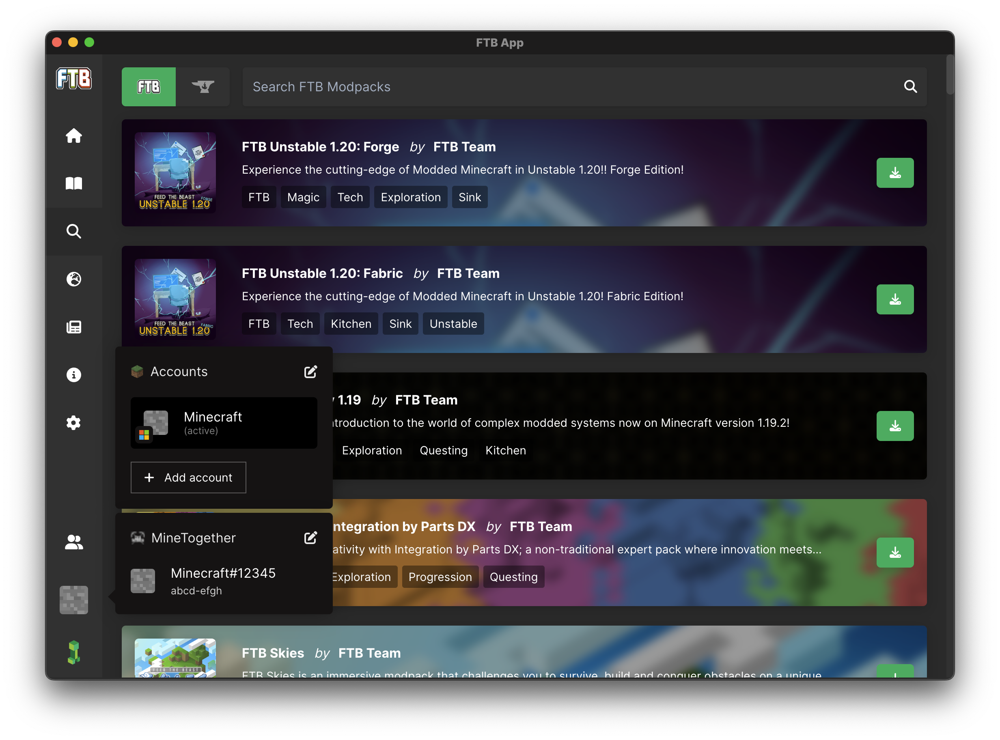
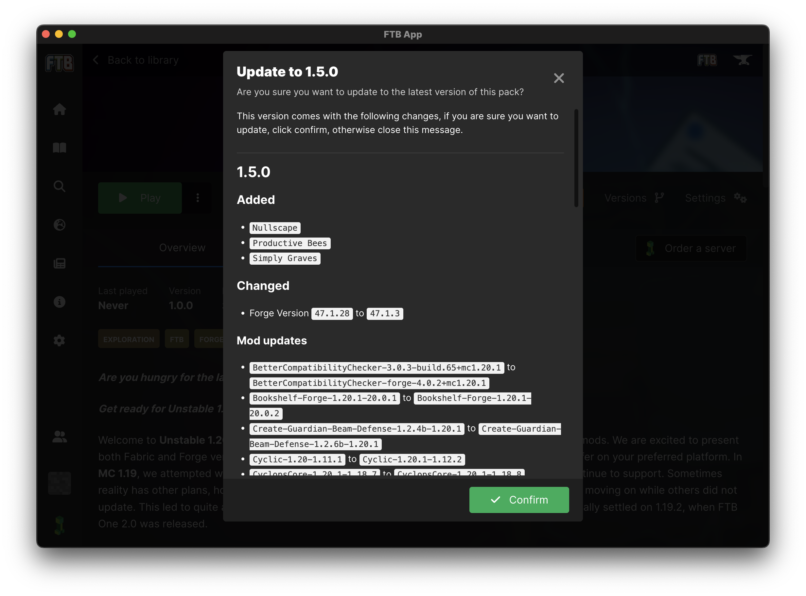
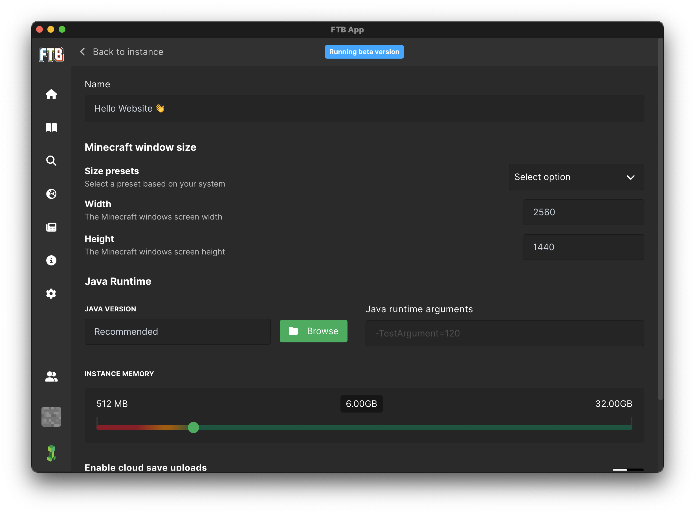

import appTutOne from '../_assets/images/ftb-app.webp';
import appTutTwo from '../_assets/images/ftb-app-browse.webp';
import appTutThree from '../_assets/images/ftb-app-browse-search.webp';
import appTutFour from '../_assets/images/ftb-app-browse-install-modal.webp';
import appTutFive from '../_assets/images/ftb-app-installing-modpack.webp';
import appTutSix from '../_assets/images/ftb-app-installing-complete.webp';

import {Slideshow} from "../../../src/components/SlideShow/Slideshow";

    # Getting Started

    Getting started with the FTB App couldn't be simpler! We'll start easy and work our way up to the more advanced features throughout this guide.

    ## Installing the FTB App

    Firstly, we'll need to actually download and install the FTB App onto your system. You can find the downloads to our app on our [downloads page](https://feed-the-beast.com/ftb-app).

    Once you have downloaded the app, you'll need to install it. This is as simple as opening the file you just downloaded and following the on screen instructions.

    ### App install Footnotes

    `On Windows` our app is powered by the [`Overwolf platform`](https://www.overwolf.com/about-overwolf). This means you'll have to have Overwolf installed in order to use the app on windows. Don't worry about this though as the download above will handle this for you.

    `On MacOS and Linux` our app is powered by a platform called [`Electron`](https://www.electronjs.org/) this platform does not require Overwolf or any other application running in the background.

    ## Logging in

    Once you have installed the app, you'll need to log in. You can either do this right when you open the app by going to the bottom left corner and hovering over the Minecraft Head, or you can wait until you first start a Modpack.

    Authentication is required for using our app but you can install modpacks and extra mods without logging in. You will need to login to play Minecraft though. If you do not have a [Minecraft account](https://www.minecraft.net/en-us), you will need to buy one before attempting to login.

    

    ## Installing your first Modpack

    Now that you're logged in, or you're ready to start looking around the Modpacks we have to offer, we can take a look at how to install your first Modpack.

    Step one is finding a Modpack you want to play, this is typically the most complicated step as there is a whole lot of choice. We recommend starting with a Modpack from the `FTB Modpacks` as these are the Modpacks we have created ourselves and we always aim to keep our Modpacks stable and supported for as long as possible. We've got a large array of different themed, types and sizes of Modpacks to pick from. Everything from [`Vanilla like`](https://feed-the-beast.com/modpacks?tags=Light&sort=featured) to [`Tech heavy`](https://feed-the-beast.com/modpacks?tags=Tech&sort=featured) and [`Questing`](https://feed-the-beast.com/modpacks?tags=Questing&sort=featured) to [`Kitchen Sink`](https://feed-the-beast.com/modpacks?tags=Kitchen%2CSink&sort=featured) and [`Magic`](https://feed-the-beast.com/modpacks?tags=Magic&sort=featured) packs.

    You can find all of our modpacks under the Magnifying glass icon on the left side of the app. This is the `Browse` section of the app. You can either pick to browse `FTB Modpacks` or `CurseForge Modpacks`.

    ### Install steps

    <Slideshow media={[
        {type: "image", url: appTutOne, title: 'The home page', text: "On the home page you can see the latest modpacks from the FTB Team and have quick access to your installed modpacks."},
        {type: "image", url: appTutTwo, title: 'Browsing', text: "You can use the browsing section to find new modpacks from the FTB Team or from CurseForge."},
        {type: "image", url: appTutThree, title: 'Searching', text: "Simply type in the name of the modpack you want to install and hit enter."},
        {type: "image", url: appTutFour, title: 'Installing', text: "When you're ready to install, press the green download icon to the right of the modpack and you should see this pop up. You'll likely not want to change the version but if you do, you can do it from here. Finally press install!"},
        {type: "image", url: appTutFive, title: 'Install progress', text: <>
                You'll get progress updates on the install as it's installing. Sometimes the Modloader step can be a bit slow but don't worry, it's not frozen. If you do run into any issues, please reach out to us on <a href="https://go.ftb.team/discord">Discord</a>.
            </>},
        {type: "image", url: appTutSix, title: "It's installed! 🎉", text: "You're ready to go! Just press 'Go to instance' and you'll be taken to the instance page where you can launch the modpack."},
    ]} />

    ## Updating modpacks

    Updating your modpacks is as simple as clicking the update button on the instance page. You can find the instance page by clicking on the instance you want to update from the `Home page` or by clicking the `Library` tab on the left side of the app.

    Updating looks very similar to installing, you'll get a progress bar and a few steps to go through. Once you're done, you'll be able to play the latest version of the modpack.

    

    ## Configuring your modpack

    Just like updating, configuring your modpack is as simple as clicking the `Settings` button on the instance page. You can configure a bunch of different things from the `Settings` page. You can change the amount of RAM allocated to the modpack, the default screen size, the name and Java version of the modpack and find some useful tools like the `Delete pack` button and the `Open folder` button.

    

    ## Removing a modpack

    You can remove a modpack at any point by clicking the `Delete pack` button on the instance's setting page.

    **Be warned!** You can not recover a modpack once it has been deleted. If you want to keep a copy of the modpack, we recommend using the `Open folder` button to open the modpack's folder and copy it to a safe location.

    ## Updating the app

    You don't need to worry about updating the app, we'll handle that for you. The app will automatically be updated in the background or when you restart the app. A helpful change log modal will appear when you restart the app after an update to let you know what's changed. You can also find the change log on our [changelog page](https://feed-the-beast.com/ftb-app/changes).

    ## Troubleshooting
    ---

    Like with any software from a small team, you're bound to run into some issues. We always hope for the best but plan for the worst. If you do run into any issues, we always first recommend restarting the app. If that doesn't work and you need some help, you can reach out to us on [Discord](https://go.ftb.team/discord). Our Discord is community run but our staff are typically around (UK time) to help out with any issues you may have.

    ### Common issues

    #### `The app is stuck on the loading screen`

    This normally means that something isn't setting up correctly. We'd recommend restarting your computer and trying again. If that doesn't work, reach out to us on [Discord](https://go.ftb.team/discord) and mention the `@App Support` team. Hopefully someone will be around to help you out.

    #### `Modpacks are not installing`

    This is normally caused by a firewall or antivirus blocking the app from downloading the modpack. We'd recommend adding an exception for the app in your firewall and antivirus. If that doesn't work, jump on the Discord as mentioned above and we'll try to help you out.

    #### `I don't want Overwolf on my system`

    That's fair, having an extra platform on your system just to run our app isn't ideal. Luckily, we now have a "Standalone" version of the FTB App that does not require Overwolf. You can download this version from the links above.

    > Please note, the standalone version still uses Overwolf`s Ad service but does not require their platform to be installed.

    #### `I can't login`

    If you're having issues logging in with your Minecraft account, ensure you are using the correct Microsoft account. It's very easy to allow Microsoft to log you in automatically to the last used account. Although this is helpful, it's not always the correct account and can easily distract you from any actual issue. You can check it's the right account by going to the [Minecraft website](https://www.minecraft.net/en-us/login) and logging in there. After logging in, go to the `My Games` tab and see if you have a `Profile Name` and `Change Skin` button under `Minecraft: Java Edition`. If you do not see this and instead see a `buy` button you are not on the correct account. If you're still having issues, jump on the Discord and we'll try to help you out.

    ### For anything else

    If you're having any other issues, please reach out to us on [Discord](https://go.ftb.team/discord) and we'll try to help you out.

