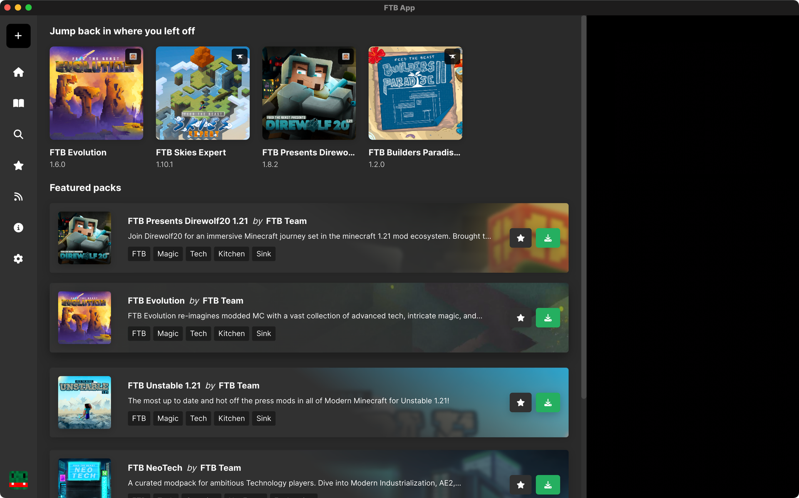
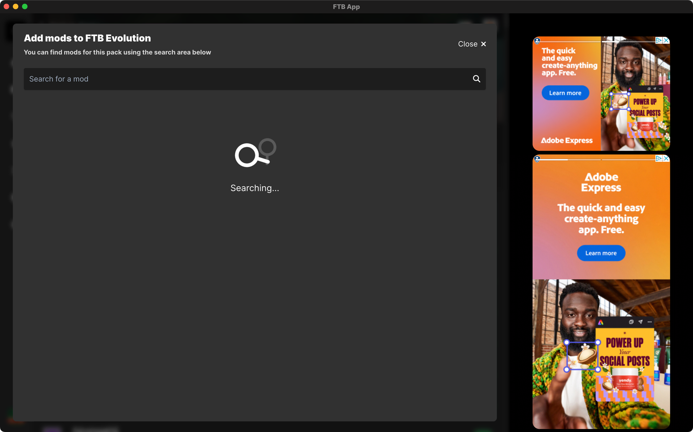
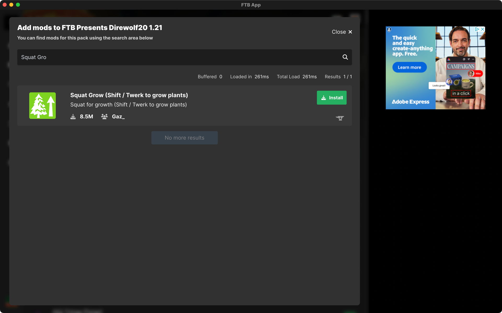
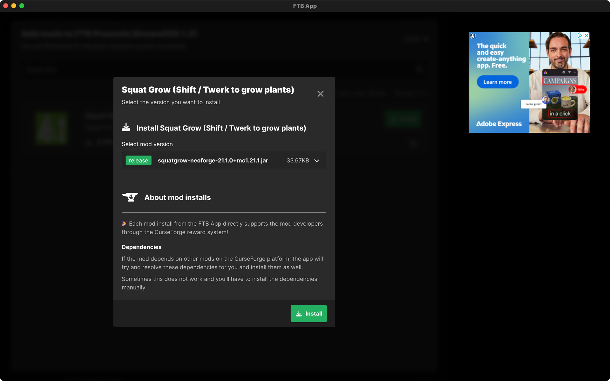

# How to add more Mods to a Modpack

:::caution
Please be aware that installing extra mods to an already configured and stable Modpack can introduce instability, out right crashing, and in some cases, world corruption. We do not want to stop you added more mods. Most of the time adding a mod will only improve your experience but it's important you know about the possible issues that may happen when installing extra mods to a Modpack.
:::

Installing more mods into a Modpack couldn't be simpler. This guide is only targeted at the FTB App. If you do not use the FTB App this guide will not help you.

There are two ways of installing Mods into a Modpack. We've outlined both of them below but using the FTB App to manage adding mods is the recommend route.

## Using the FTB App to add extra mods

:::tip
You may need to unlock the instance first before you can add mods.

You can do this by going to the instance settings then clicking the `Unlock instance` button.
:::

1. Open the FTB App
2. Locate your installed Instance / Modpack. For examples sake, let's say we're installing a new mod to `FTB Presents Direwolf20 1.19`.
3. Select the mods Tab just under the play button
4. To the right of the sidebar, you will see a button titled `Add more mods`, select that.
5. A box will pop up asking you to search for the mod you'd like to add. In this example, I want to add `Toolbelt` so I'm going to search for that.
6. If the mod you searched for is available, you should now see a list of mods with an install button next to it.
7. Select install and select the version you would like to install
    - The latest version is typically the right choice here.
    - The FTB App will only show you mods that are compatible with the ModLoader & Minecraft you have on the Modpack you're adding mods to.
8. You're done! If all went well, you should now see this mod in the mods list!

## Installing manually

Installing manually requires you to find your own mods first. There are many websites to find mods on but the only trusted websites are:

[https://curseforge.com](https://curseforge.com) and [https://modrinth.com](https://modrinth.com). Most other websites are likely rehosting developers work without their permission and in some causes modifying the mods to turn them into spyware / malware. We do not recommend using any other websites than the two listed here. You can read more about this here: [https://stopmodreposts.org/](https://stopmodreposts.org/)

1. Find the mods you'd like to install from a website listed above
2. Download the mods
3. Open the FTB App
4. Locate the instance you'd like to add extra mods to
5. Select the three dots button `⠇` button next to the play button
6. Select `Open`
7. Select `Mods Folder`
8. Place the files you downloaded from `step 2` and place them in the folder that opened.
9. Try them out! Start up the game and see if it's all working.

## Troubleshooting

:::info My Game crashes
This will happen sometimes, not all mods will work with other mods. Especially performance mods. You can ask in our [Discord](https://go.ftb.team/discord) for support if you can't find out why it's crashing. Typically game crashes log out very detailed reasons why the game crashed. You can find a guide on how to [find game logs here](./instance-logs).
:::

:::info The mod won't install
Strange, typically this feature will just work... We'd recommend asking in our [Discord](https://go.ftb.team/discord) for help, specifically in the #ftb-app-support channel.
:::

:::info I can't find the mod I want
Right now, we only support mods on the [CurseForge](https://curseforge.com) website. If you're looking for mods that aren't on this website, you won't be able to use this feature.

Some mods only support specific Minecraft versions, if the mod does not support the Minecraft version the Modpack is built for; The app will not show you the mod to prevent versioning based crashes.
:::

## Screenshot Guide for using the FTB App

**Open the FTB App**

**Locate the pack you want to install extra mods to**

**Adding extra mods**

**Searching for mods**

**Installing a mod**

**You're done, enjoy your extra mods! 🎉**

