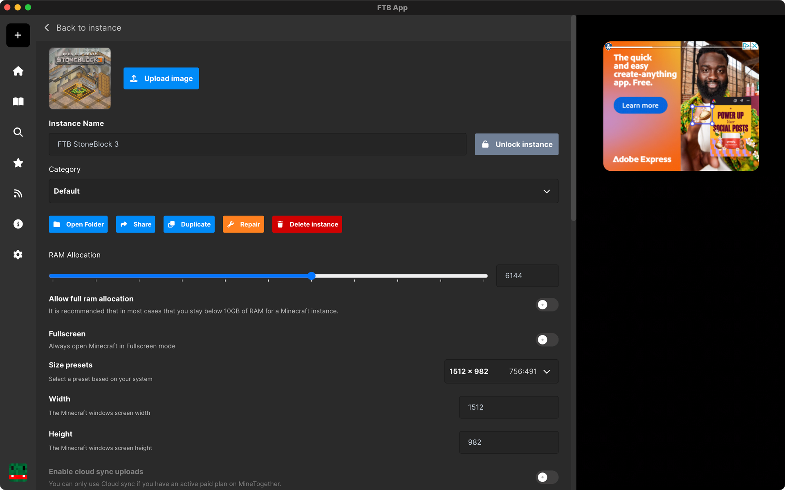

# Repair instance

Repairing an instance is a simple process that can fix some issues you may be experiencing with your instance. This guide will show you how to repair your instance.

## Repairing an instance

1. Open the FTB App and navigate to the `Library` tab.
2. Find the instance you want to repair and right click on it
3. Click on the settings option
4. You will now be on the instance settings page. Which should look like this:

5. Click on the `Repair` button
6. The app will now start the repair process. This may take a few minutes depending on the size of the instance and the speed of your computer.
7. Once the repair is complete, you should be able to start the instance as normal.
