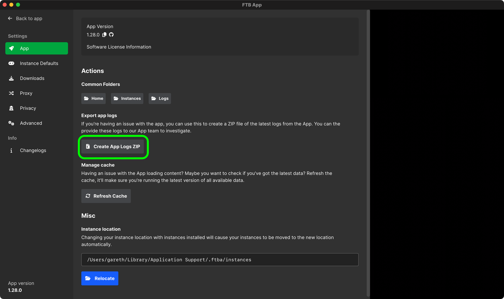

# Find App Logs

:::caution Notice
This guide will soon become outdated with the migration to full utilising the [FTB Debug Tool](./ftb-debug). This guide is still valid as of `2022/12/31`
:::

You should only need to find the app logs if something has gone wrong. This guide walks you through finding the app logs.

Finding the logs is simple, you will first need the app open. For best results, run the app logs right after you've experienced an issue.

## Locating the logs

1. Have the app open
2. Navigate to the settings of the app (Located in the bottom left)
3. Select `App Info` on the left side
4. Then select the blue button titled `Upload App Logs`
    - This will upload the app logs and place a link to them in your clipboard.
5. Paste this code to the member of our team supporting you with your issue.

Done correctly, you should be on a page that looks a bit like this one.

## Troubleshooting

:::info Nothing happened
In some rare cases this might not work. If this happens for you, we recommend using the debug tool instead. You can find the guide on how to use this tool [here](./ftb-debug).
:::
