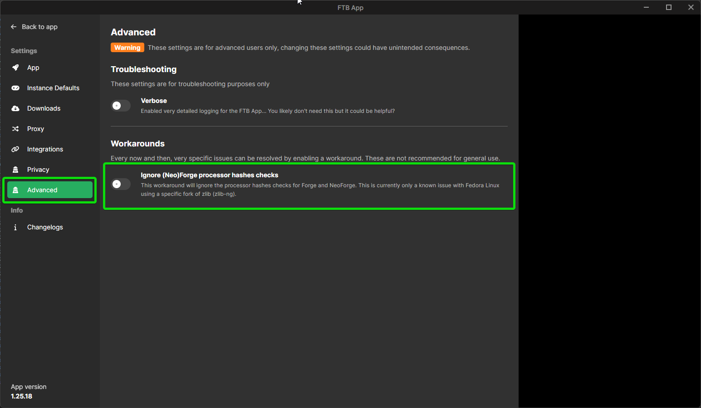

This workaround will ignore the processor hashes checks for Forge and NeoForge. This is currently only a known issue with Fedora Linux using a specific fork of zlib (zlib-ng).

## Disabling the processor hashes check

1. Open the FTB App
2. Click on the settings icon in the sidebar
3. Click on `Advanced` in the sidebar of the settings page
4. Enable the `Ignore (Neo)Forge processor hashes checks` option

