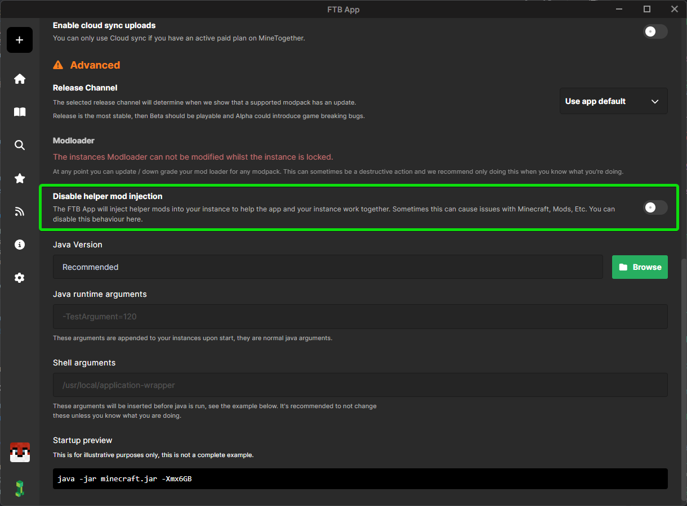

This workaround will ignore the processor hashes checks for Forge and NeoForge. This is currently only a known issue with Fedora Linux using a specific fork of zlib (zlib-ng).

# Disabling the processor hashes check

## Disabling FTB Hide/FTB Progress

1. Open the FTB App
2. Go to the Instance you want to disable FTB Hide/FTB Progress on
3. Click on the Setting button on the right of the screen
4. Scroll down to the `Advanced` section and then the enable `Disable helper mod injection` option

   

When you start the modpack up now, you should notice that the Minecraft loading screen is no longer hidden.
