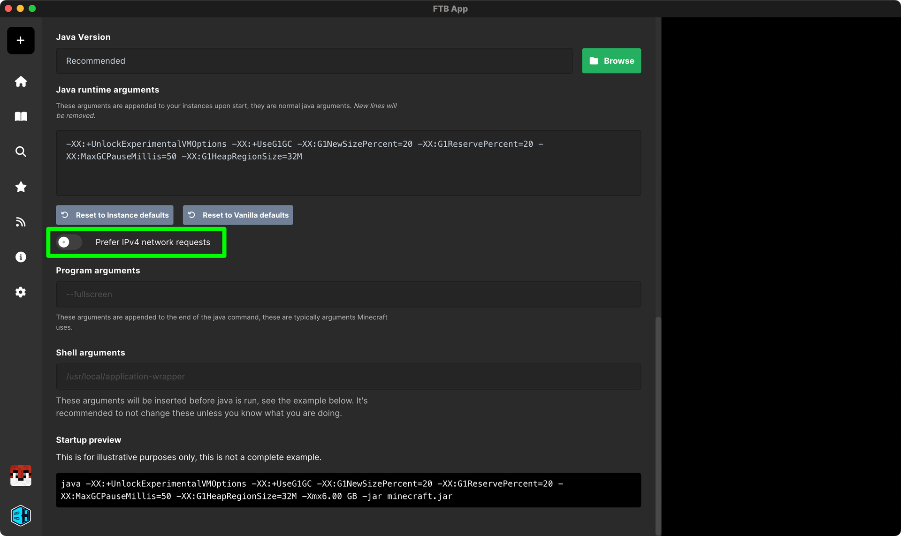

This workaround will add the `-Djava.net.preferIPv4Stack=true` JVM argument to the modpack. This can help with networking issues on some systems where Minecraft is unable to authenticate with Mojang's servers.

## Enabling Prefer IPv4 Networking

1. Open the FTB App
2. Go to your modpack library
3. Right-click on the modpack you want to enable Prefer IPv4 Networking on and click on settings
4. Scroll down to the `Advanced` section and enable the `Prefer IPv4 network requests` option

