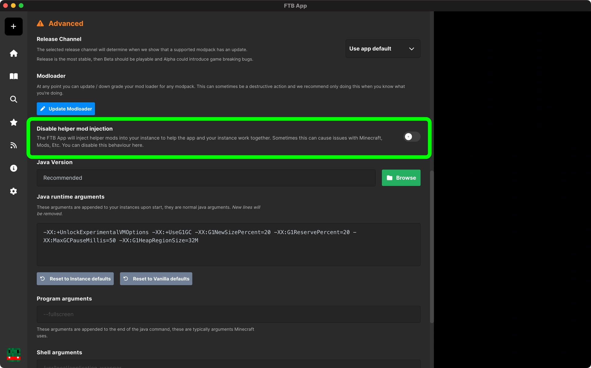

FTB Hide/FTB Progress are mods that are included in some modpacks that hide the loading screen and show the loading progress in the app. This guide will show you how to disable them.

# Disabling the FTB Hide/FTB Progress mods

:::tip Terminology
The word `Instance` is typically used to relate to a Modpack that you have installed to the FTB App
:::

## Disabling FTB Hide/FTB Progress

1. Open the FTB App
2. Go to the Instance you want to disable FTB Hide/FTB Progress on
3. Click on the Setting button on the right of the screen
4. Scroll down to the `Advanced` section and then the enable `Disable helper mod injection` option

   

When you start the modpack up now, you should notice that the Minecraft loading screen is no longer hidden.
