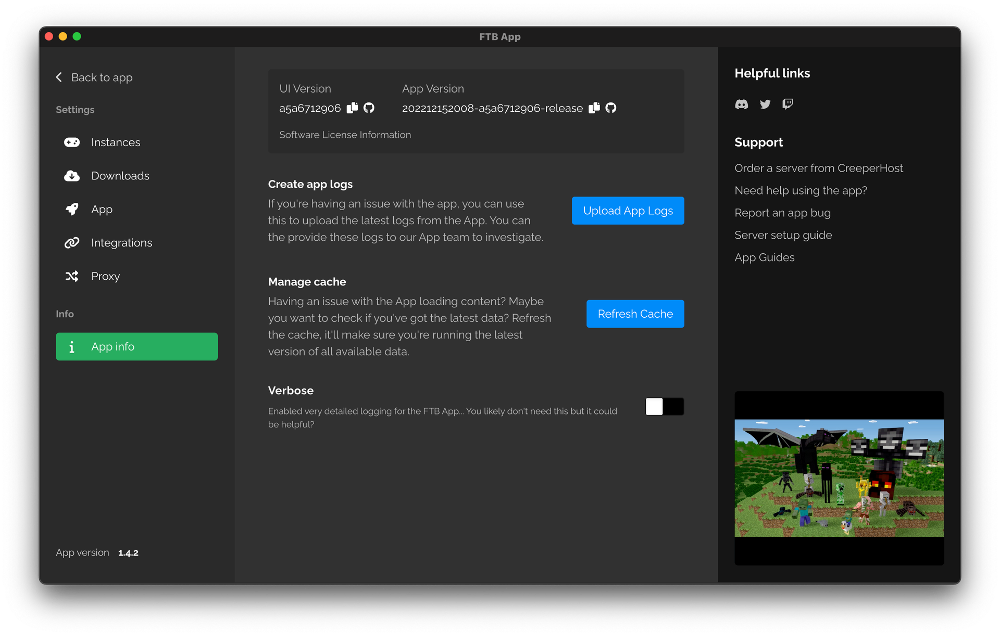

# Find App Logs

You should only need to find the app logs if something has gone wrong. This guide walks you through finding the app logs.

Finding the logs is simple, you will first need the app open. For best results, run the app logs right after you've experienced an issue.

## Locating the logs

1. Have the app open
2. Navigate to the settings of the app (Located in the bottom left)
3. Select `App` on the left side
4. Then select the blue button titled `Create App Logs ZIP`
    - This will create a ZIP file containing the app logs and save it to your computer, it may take a few seconds to complete and once it is done, a file explorer window will open showing you the ZIP file, it will also show a message in the app that the ZIP has been created and where its located.
5. Upload the ZIP to the member of our team supporting you with your issue.

Done correctly, you should be on a page that looks a bit like this one.

## Troubleshooting

:::info Nothing happened
In some rare cases this might not work. If this happens for you, we recommend using the debug tool instead. You can find the guide on how to use this tool [here](./ftb-debug).
:::
