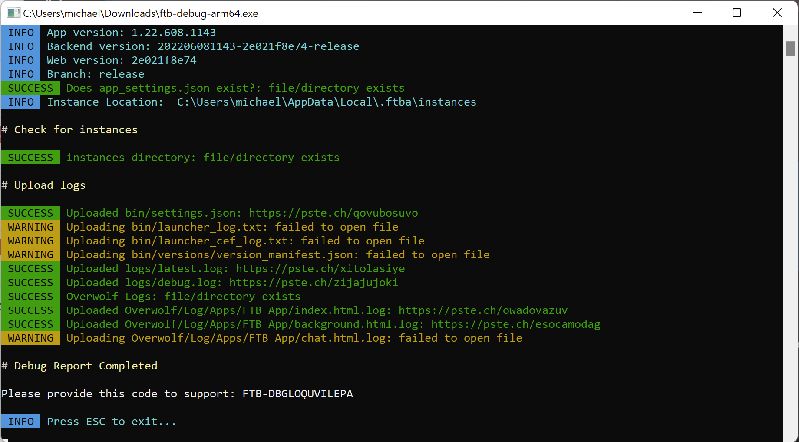

# FTB Debug Tool

The FTB Debug Tool (otherwise known as `FTB-DBG`) is a tool created by FTB to provide our team as much information about the environment the app is running in and any issues that may have present during runtime. 

::: tip Disclaimer
No sensitive information is ever shared using this tool!
:::

In this guide, we'll show you the basics of running the debug tool and how to provide the right information to our team to support you.

If you do not have an issue. You do not need to use this guide.

## Downloading

You can find the download links for each operating system we support. We've included ARM versions for each system but unless you know you're running an ARM machine, you'll likely want the `Intel / AMD 64` versions. 

| Operating System | Architecture        | Link                                                                                    |
|------------------|---------------------|-----------------------------------------------------------------------------------------|
| Windows          | Intel / AMD         | [Download (**Recommended**)](https://dist.creeper.host/tools/ftb-debug/ftb-debug.exe)   |
| Windows          | Arm                 | [Download](https://dist.creeper.host/tools/ftb-debug/ftb-debug-arm64.exe)               |
| MacOS            | Intel / AMD         | [Download (**Recommended**)](https://dist.creeper.host/tools/ftb-debug/ftb-debug-macos) |
| MacOS            | Apple Silicon / ARM | [Download](https://dist.creeper.host/tools/ftb-debug/ftb-debug-macos-arm64)             |
| Linux            | Intel / AMD         | [Download (**Recommended**)](https://dist.creeper.host/tools/ftb-debug/ftb-debug-linux) |
| Linux            | Arm                 | [Download](https://dist.creeper.host/tools/ftb-debug/ftb-debug-linux-arm)               |

## Using

Using the FTB Debug Tool is typically as simple as double-clicking the `.exe` file that you downloaded from above. In some cases it's a bit more complicated so we've outlined what you need to do for [`Linux & MacOS`](#using-on-macos-linux) below.

Once you've downloaded the tool, you'll want to run it. A successful run will look like this



You can see that after the application has run, you are given a code, in this example the code is `FTB-DBGLOQUVILEPA`. Copy this code and provide it to the support team member that has requested it from you.

If something has gone wrong, see our [troubleshooting](#troubleshooting) guide below. 

### Using on MacOS & Linux

Using the debug tool on MacOS and Linux is a little more involved but is still relatively simple. You can follow this simple step by step guide to see how to run the tool.

1. Download the tool ([Download](#downloading))
2. Open the `Terminal` (Linux users, open your distro's variant of the terminal)
3. Run `cd {location of the debug tool}` typically this will be the downloads' folder. A real example of this would be `cd /home/mikey/Downloads/`
4. Run the follow command `chmod +x ftb-debug-macos` (`chmod +x ftb-debug-linux` for linux operating systems). Add `-arm64 or -arm` respectively for ARM systems
5. This step is optional as most systems will now let you double-click the file. If this is not the case. Simple run the same command as above but replace `chmod +x` with `./`. An example of this would be `./ftb-debug-linux`.
6. Provide the code to the support member that asked for the code
7. Profit!

```bash
# Example of the full flow
cd /home/mikey/Downloads
chmod +x ftb-debug-linux
./ftb-debug-linux
```

## Troubleshooting

::: details It's not working on Windows
Windows may sometime block the running of the application. Make sure you've allowed it past your anti-virus & windows defender.
:::

:::details It's complaining about the wrong operating system
This will happen when you've download the wrong file for your operating system. Remember that most operating systems are Intel/AMD based so that is likely the right file for you.
:::

