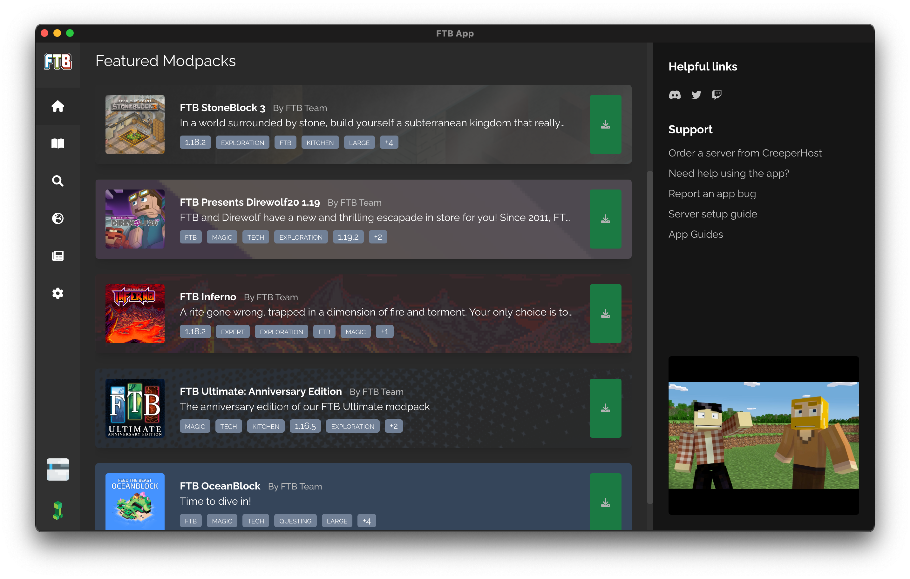

# How can I adjust the RAM of a Modpack

Adjusting the RAM that a Modpack uses couldn't be simpler. Inside the Modpacks settings, you can drag a slider to modify how much RAM a pack uses. 

Modifying the RAM usage of Minecraft can cause performance issues. Please read all the following warning first.

::: warning
Please note, each **FTB Modpack** is tested and tuned to use the best values for minimum and maximum ram usage. After the Modpack has been installed, these values will be used by default.
:::

::: warning
Assigning too much RAM to a Modpack can cause stuttering and performance issues. We won't go into the complexities of why this is the fact but we'd never recommend more than 10GB and even then, that's pushing it a bit.
:::

::: warning
Never manually configure the `-Xmx` using the FTB App. This will cause issues. Please only ever use the slider provided in the Modpack Settings.
:::

## Adjusting the RAM

1. Open the FTB App
2. Select the Modpack you wish to modify the RAM usage on
3. Click on the `settings` button on the right of the screen
4. Find the section titled `Instance Memory`
5. Drag the slider provided to the desired value
   - The slider allows you to assign as much RAM as you'd like that your system has available. We do not recommend exceeding 10GB for any Modpack!
6. You're done, this setting will be saved automatically

## Screenshot Guide

**Open the FTB App**

**Select the instance**

**Go to settings & drag the slider**

**You're done! 🎉**
