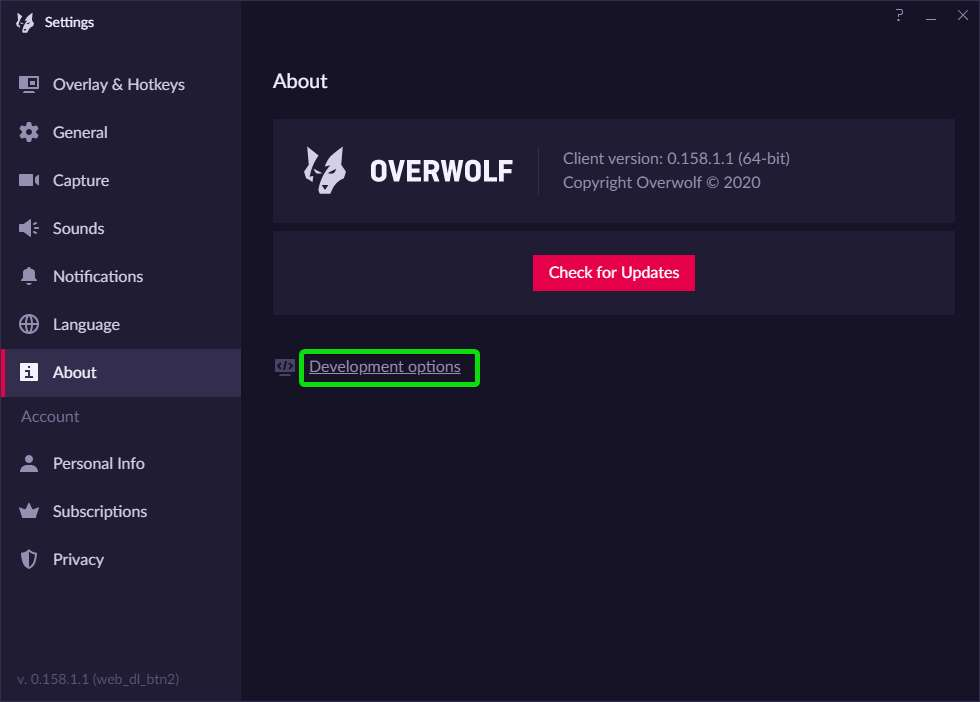

# How to forge update the FTB App on Overwolf

The FTB App can sometimes take quite a while to update on Overwolf. If this is the case and you're waiting on a new feature for the FTB App. You can force the App to update. If you're not in a rush to update the app, we'd recommend against following this guide.

## Steps

1. Open the Overwolf App
2. Click on the settings cog in the top right
3. Select About from the menu on the left
4. Select `Development Options` from the bottom of the about page
5. On the window that pops up, select the button titled `Update extensions now`
6. After this has run, you should see a higher version number on the FTB App.

## Screenshot guide

**Open Overwolf**

**Open Settings**

**Select About**

**Developer Options**

**Notice the version change**

**You're done! Enjoy the update 🎉**
