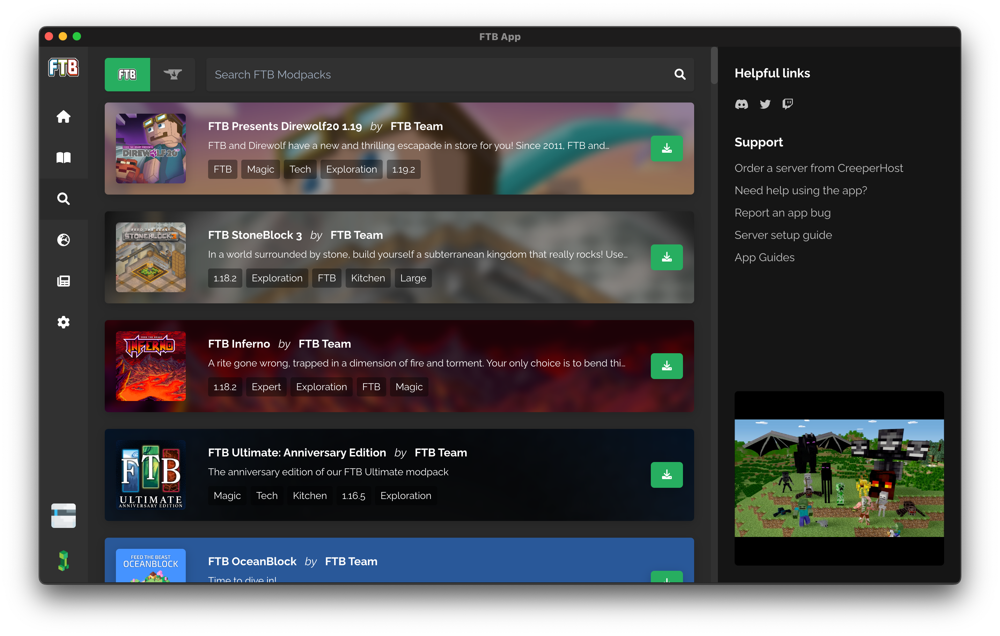
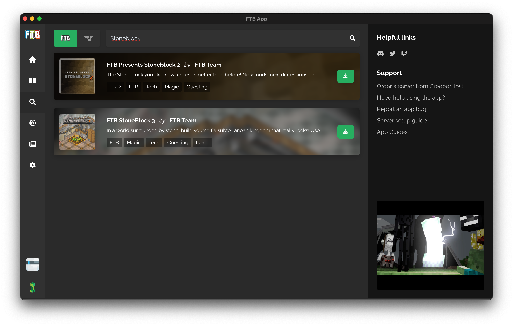
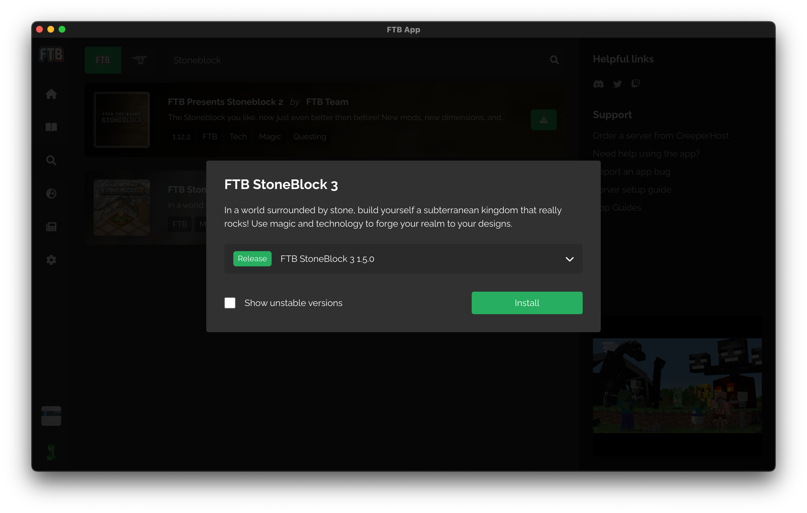
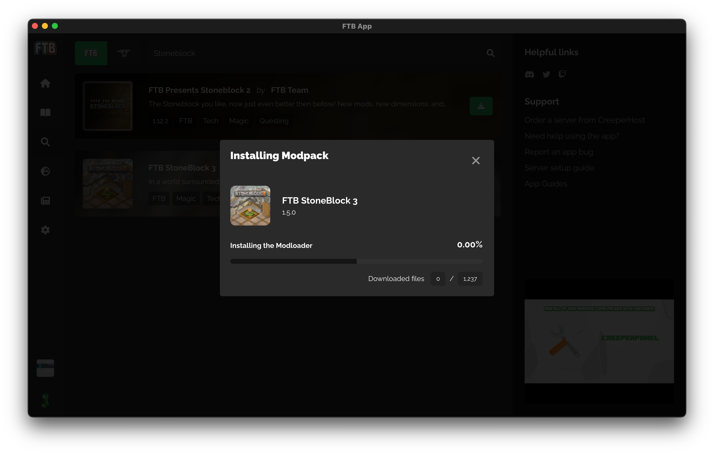

# How to install a Modpack in the FTB App

Installing a modpack to the FTB App couldn't be simpler! So simple in fact, we're sure you can follow this step by step guide.

1. Open the FTB App
2. Select `Browse` from the left side of the app (The search icon)
3. Search for any `FTB Modpack` or any `CurseForge Modpack` using the search at the top of the page.
4. Select the pack you want to install
5. Click install
6. Then select the version you wish to install and select `install`
    - Most of the time, you want the latest version.
7. You're done! Enjoy the pack 👍

## Something went wrong

Oh no... There can be a few reasons this might happen but we always recommend reaching out in our support channel on [Discord](https://go.ftb.team/discord).

## Screenshot guide

**Open the FTB App**

**Select Browse**

**Search for a Modpack**

**Click install (The download icon)**

**Wait for the modpack to install**

**You're done!**

