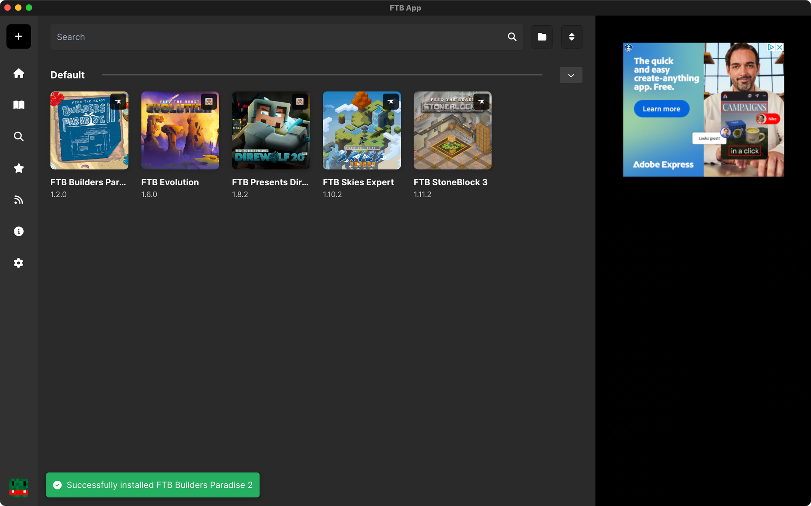

## Welcome to the FTB App Documentation! 

The FTB app is our take on a Modded Minecraft Launcher. Primarily it is focused on providing our modpacks to our users but we also support Curseforge modpacks via their API.

## Features

- **Modpacks** - We have a wide range of modpacks available to download and play.
- **Curseforge Modpacks** - We support Curseforge modpacks via discovery or `.zip` file importing.
- **Modpack Creation** - You can create your own modpacks in our app using our instance creator.
- **Modpack Sharing** - Share your modpacks with your friends or the world via our modpacks sharing system.
- **Modpack Updates** - Regardless of Modpack Provider, we can always keep your modpacks up to date
- **Profile Management** - You can add multiple Minecraft accounts to the app and switch between them with ease.
- **Instance Library** - You can add or create as many instances as you like and pick any of them to play at any time.
- **Mod Management** - You can update, remove or add new mods*.
- **Java Management** - Via the modpack settings, you can manage your Java version, add Java arguments and more.

*Searching for mods is a feature provided by Curseforge. We currently do not support adding mods from Modrinth or other mod hosting sites.

## What's Next?

Check our our guides on how to use the FTB App and get started with your first modpack!

- [Installing a modpack](/docs/app/Guides/install-modpack)
- [Removing a modpack](/docs/app/Guides/remove-modpack)
- [Learn how to add mods to a modpack](/docs/app/Instances/add-mods-to-instance)

And much more, checkout the sidebar for more guides, information and troubleshooting tips!
