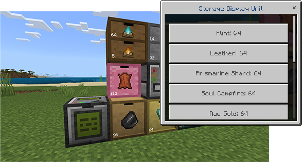
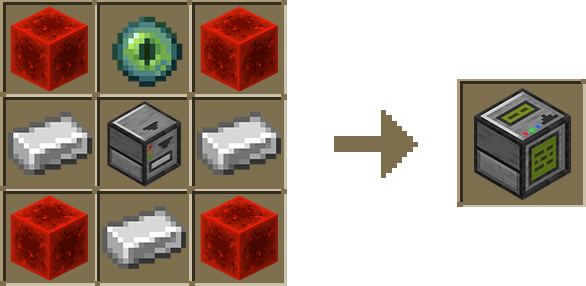
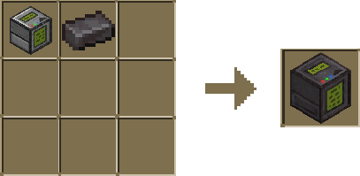

Access your items quickly using the Storage Display Unit.

Place the Storage Display Unit near your Drawers.
Interact with the Storage Display Unit.
View a list of all items in Drawers within an 8-block radius.
Click on an item to remove a stack.

:::note
You can only view and remove items.
:::

### Crafting

Crafting a Storage Display Unit is simple! Just combine 4 redstone, 3 iron ingots, 1 eye of ender and a single Drawer Controller in the crafting grid.

#### Upgraded Storage Display Unit

To upgrade your Storage Display Unit, pick up your existing storage display unit and place it in a crafting grid with a netherite ingot.

With the Upgraded Display Unit, players gain the flexibility to remove a desired quantity of items, replacing the fixed 64.
