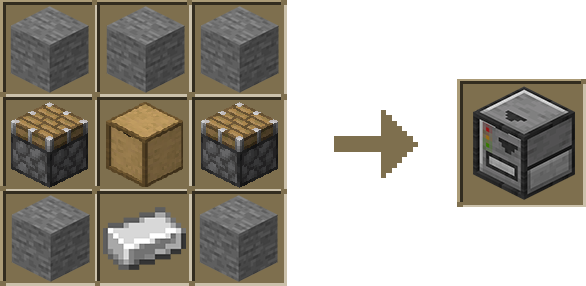
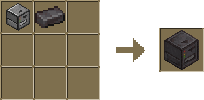
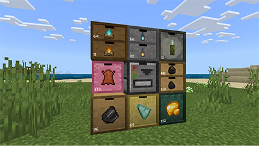

Level up your organization! The Drawer Controller takes storage to the next level.

### Crafting

Crafting a Drawer Controller is simple! Just combine 5 stone, 2 pistons, 1 iron ingot and a single Storage Drawer in the crafting grid.

#### Upgraded Drawer Controller

To upgrade your drawer controller, pick up your existing drawer controller and place it in a crafting grid with a netherite ingot.

The Upgraded Drawer Controller is like the regular one, but with a significantly increased range of 16 blocks!

### Usage

Effortless Inventory Sorting!

Right-click the Drawer Controller to instantly distribute all your held items into the appropriate drawers within an 8-block radius.

But remember, for the magic to work, each drawer needs to already have at least one item inside to act as a category.

