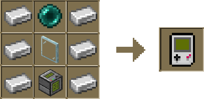

Introducing the Locator and Inventory Network Key (L.I.N.K. Device™).

This portable version of the Display Unit can be used anywhere.

Link the L.I.N.K. Device™ to a Display Unit by interacting with it while holding the device. Once linked, it mirrors the Display Unit's functionality.

### Crafting

To craft a L.I.N.K. Device™, combine 6 iron ingots, 1 ender pearl, and a single Display Unit in the crafting grid.

