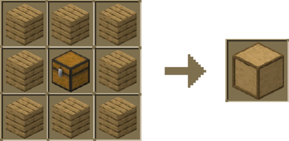
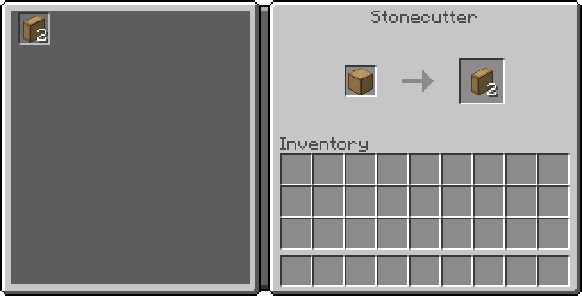
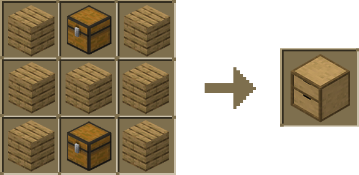
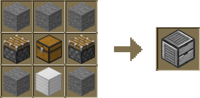

Unleash your creativity! Craft Storage Drawers from a variety of materials:

    
Available Materials

    - Planks (various wood types)
    - Wool (various colours)
    - Andesite
    - Blackstone
    - Cobblestone
    - Copper
    - Deepslate
    - Diorite
    - End Stone
    - Granite
    - Nether Brick
    - Prismarine
    - Purpur
    - Stone
    - Stone Brick

### Drawer

Crafting Storage Drawers is a breeze! Just combine a chest with your choice of material.

### Half Drawer

Storage Drawers also have half block variants.

To create a half block version, simply pop any Storage Drawer into a Stonecutter.

### Double Drawers

Need to store more items in a compact space? Double Drawers are the solution.

These drawers function like regular Drawers but have two compartments, each capable of holding up to 16 stacks of an item(without upgrades)

**They can also be placed in a Stonecutter to make half block versions.**

### Compacting Drawer

The Compacting Drawer is a special storage block that automatically converts items between their compacted and original forms.

It’s perfect for managing resources like iron, gold, and more.

