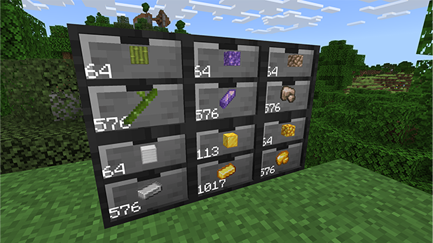

There is no traditional-slotted inventory with these containers.
Clicking on one of the drawers on the front will interact with that drawer.

Right-Click / Interact: Insert the current in-hand stack, no matter the stack size everything in your hand will be inserted.

Sneak + Right-Click / Interact: Insert all items of the same type from your inventory. (up to 2048 without upgrades)

Left-Click / Punch: Remove one single item from the drawer.

Sneak + Left-Click / Punch: Remove a whole stack from the drawer.

### Stacking Drawer

Don't be afraid to stack 'em up! Experiment with building your storage system in different configurations.

**To place Drawers on top of each other, players must be sneaking.**

### Compacting Drawer

1. Choose a material (for example, an Iron Block).

2. Place it into the top slot of the drawer. You’ll see it automatically display the equivalent amount of Iron Ingots.

3. Take out either block or ingot, just like you would with any regular drawer.

The Compacting Drawer supports a wide variety of blocks. These include...

- Iron Ingot -> Iron Nugget
- Iron Block -> Iron Ingot
- Gold Ingot -> Gold Nugget
- Gold Block -> Gold Ingot
- Diamond Block -> Diamond
- Emerald Block -> Emerald
- Lapis Block -> Lapis Lazuli
- Quartz Block -> Quartz
- Netherite Block -> Netherite Ingot
- Copper Block -> Copper Ingot
- Coal Block -> Coal
- Redstone Block -> Redstone
- Slime Block -> Slime Ball
- Clay Block -> Clay
- Melon Block -> Melon Slice
- Raw Copper Block -> Raw Copper
- Raw Gold Block -> Raw Gold
- Raw Iron Block -> Raw Iron
- Snow Block -> Snow
- Packed Ice -> Ice
- Blue Ice -> Packed Ice
- Stone Bricks -> Stone
- Glowstone -> Glowstone Dust
- Bone Block -> Bone Meal
- Bamboo Block -> Bamboo
- Hay Block -> Wheat
- Amethyst Block -> Amethyst Shard

:::note
You can also insert Ingots in the top slot to display and extract both Ingots and Nuggets.

Inserting Ingots into the bottom slot will allow you to convert them into Blocks.
:::
