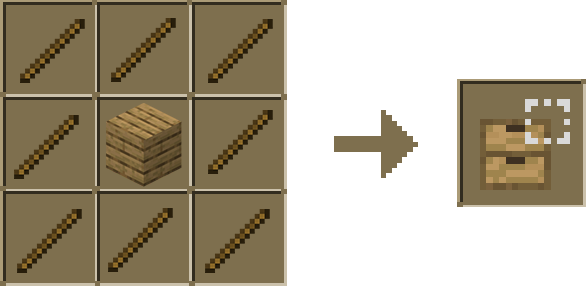

Upgrades can significantly enhance Storage Drawers, from increasing capacity to adding features like lighting.

The Upgrade Template is the essential foundation for all upgrades.

### Upgrade Template

The Upgrade Template is the base for all upgrades. It can be crafted using a Storage Drawer and a Redstone Dust.

### Available Upgrades

There are 8 different upgrades that you can use to customize your Drawers.

But you can only place up to 7 upgrades in the available slots.

You can mix and match to create your ideal setup.

For example, if you add only Storage Upgrade(V) to all 7 slots, you will achieve the maximum storage capacity.

- Storage Upgrade(I) - 2x Base value.
- Storage Upgrade(II) - 4x Base value.
- Storage Upgrade(III) - 8x Base value.
- Storage Upgrade(IV) - 16x Base value.
- Storage Upgrade(V) - 32x Base value.
- Light Upgrade - Illuminates the Drawer.
- Void Upgrade - Removes excess items.
- Person Lock Upgrade - Locks to Owner
