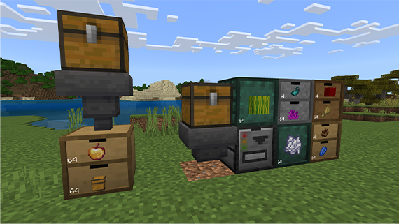

### Hoppers

Hoppers can automate item storage in Storage Drawers.

To use a Hopper with a Storage Drawer:

1. Place your Storage Drawer.

2. Fill the Drawer with at least one of the items you want to store.

3. Position a Hopper next to the Drawer, ensuring it faces the Drawer.

4. Place additional items into the Hopper. They will automatically be transferred to the Drawer.

You can also use Hoppers with a Drawer Controller to efficiently and automatically sort items.

Remember, each Drawer connected to the Controller needs at least one item of the desired type to start the sorting process.
