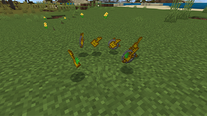
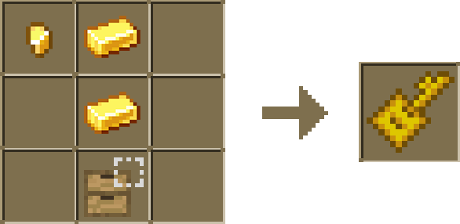
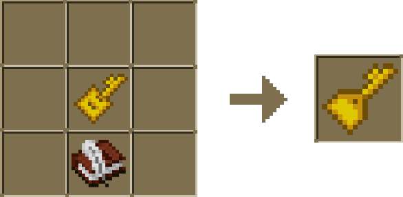
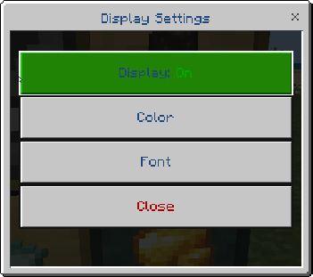
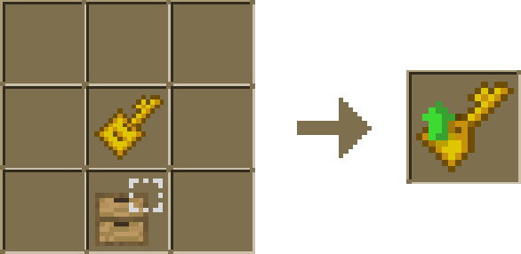
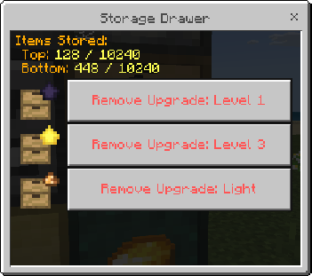
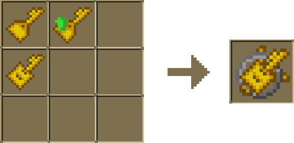

Keys are your master control for Drawers.

Use them to lock Drawers to specific block types, customize how amounts are displayed, and manage upgrades.

### How to Use Keys

To use a Key, simply right-click on a Drawer with it in hand. This will perform the corresponding action based on the type of Key you have.

### Drawer Key

Use the Drawer Key to lock a Drawer to a specific item.

Place your item in the Drawer, then interact with the Drawer while holding the key.

To unlock, right-click the Key again.

### Display Key

Interact with a Drawer while holding the Display Key to adjust its display settings.

#### Display Key Menu

This menu appears when you use the Display Key.

Here, you can toggle the display, color, and font.

### Upgrade Key

Interact with a Drawer while holding the Upgrade Key to remove any applied upgrades and view its total capacity.

#### Upgrade Key Menu

Use the Upgrade Key to access this menu.

Here, you can view your total storage capacity and remove any applied upgrades.

### Key Chains

Combine all three Keys to create a Keychain for easy access.

To switch keys, sneak and interact in the air.

