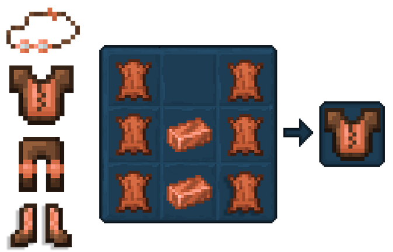
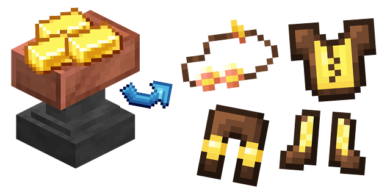
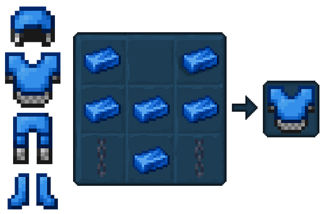
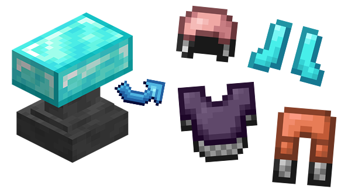
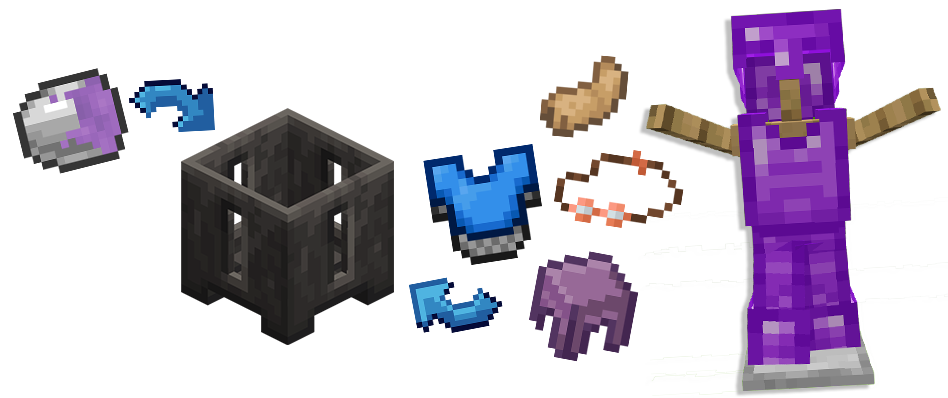

## Armour

Tinkers' adds new slimes into your world! Each boasts unique properties to elevate your gameplay.  
Dive in, discover their slimy secrets, and harness their power for tinkering triumphs!

Here's the you can find: 
 - [**Earth Slime Sling**](#earth-slime-sling)
 - [**Sky Slime Sling**](#sky-slime-sling)
 - [**Scarlet Slime Sling**](#scarlet-slime-sling)

### Travelers Armour

Travelers Armour can be crafted using Copper Ingots and Leather in a Crafting Table.

Think of this as an upgraded regular Leather set, which has slightly better defence.

The Traveler's Set can also be combined with Gold Ingots in a Tinker's Anvil to create the Traveler's Gold Armor. 

However, this is purely cosmetic and won't provide any other benefits.

### Plate Armour

Plate Armour is crafted using Cobalt Ingots and Chains.

It has fairly high durability and protection stats which are slightly higher than a regular Iron set.

Plate Armor is also highly customizable. By combining a piece with any of the three types of ingots in a Tinker's Anvil, you can change its appearance to match the ingot's material. 

However, this is purely cosmetic and won't grant any additional benefits.

### Slime Armour

Slime Armour can be created by pouring Liquid Ender Slime onto either a Rabbit Foot, Shulker Shell, Plate Chestplate or Travelers Googles.