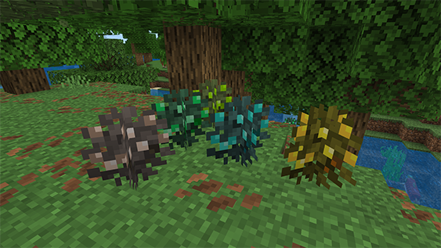
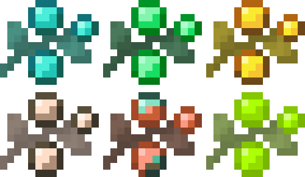

Berry Bushes can naturally spawn throughout your world, though they are quite rare—so keep an eye out!

When broken, Berry Bushes drop Berry Bush Seeds.

However, if you interact with a fully grown Berry Bush instead of breaking it, you'll harvest 2 to 4 Berries.

To grow your own Berry Bushes, you'll need Berry Bush Seeds, which can only be obtained by breaking wild bushes or trading for them.

Once you've harvested enough Berries, you have two options: eat them or smelt them.

### Smelting Berries

Smelting Berries will yield either Nuggets or Shards, depending on the type of resource.

You can then combine 9 Nuggets or 9 Shards to craft an Ingot, Emerald, or Diamond, based on what the Berry produced.

```crafting smelting
ftbtc:item/diamond_berries
coal
result: ftbtc:item/diamond_shard, 1
```

### Eating Berries

When you eat an Ore Berry you will get a specific effect.

Diamond - Health Boost for 30s
Emerald - Hero of the village for 30s
Gold - Speed for 30s
Iron - Resistance for 30s
Copper - Haste for 30s
XP - Adds 5 xp to the player



## Berry Bundle

```crafting table
bundle ftbtc:#berries -
result: ftbtc:item/berry_bundle, 1
```

The Berry Bundle is a special type of bundle designed specifically to hold Ore Berries.

It functions just like a regular bundle, with the same limitations—able to hold up to 64 items total, regardless of item type or stack size.

