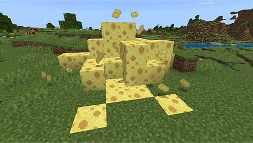
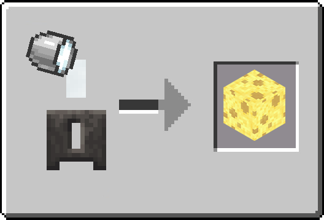
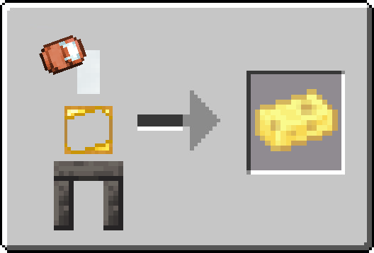

Cheese is a new food item introduced in Tinkers’ Construct, available in both Blocks and Ingots.

Eating a Block of Cheese will clear any active effects and return 3 Cheese Ingots.

Consuming a Cheese Ingot also clears all active effects, but does not return anything.

## Making Cheese

Pour a Bucket of Milk directly into a Casting Basin. Over time, the milk will solidify into a Cheese Block.

Place an Ingot Cast onto the Casting Table, then pour a Copper Can of Milk into it. The milk will solidify into a Cheese Ingot.
