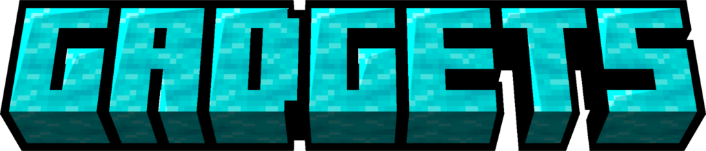
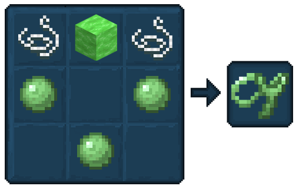
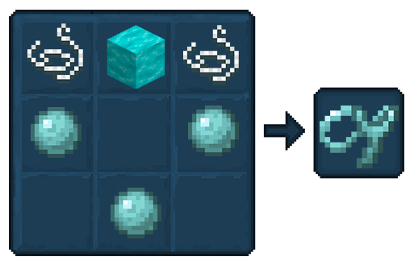
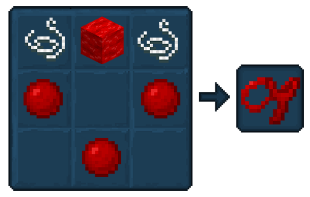
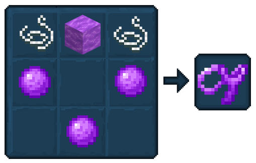
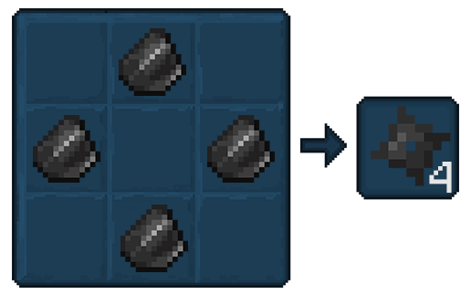
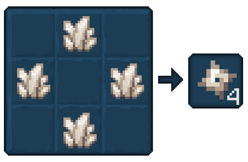
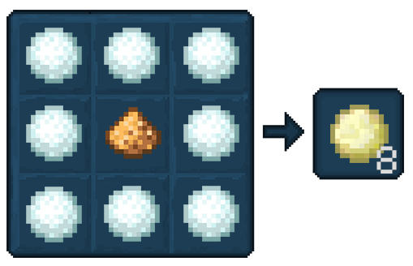
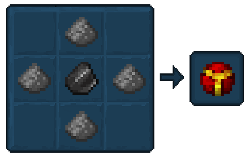

## Gadgets

Tinkers' adds new slimes into your world! Each boasts unique properties to elevate your gameplay.  
Dive in, discover their slimy secrets, and harness their power for tinkering triumphs!

Here's the you can find: 
 - [**Earth Slime Sling**](#earth-slime-sling)
 - [**Sky Slime Sling**](#sky-slime-sling)
 - [**Scarlet Slime Sling**](#scarlet-slime-sling)
 - [**Ender Slime Sling**](#ender-slime-sling)
 - [**Flint Shuriken**](#flint-shuriken)
 - [**Quartz Shuriken**](#quartz-shuriken)
 - [**Glowball**](#glowball)
 - [**ELFN**](#efln)

### Earth Slime Sling

The Earth Slime Sling can be crafted in the Crafting Table.

When used(whilst looking at the floor) it’ll fling the user up in the air, the longer you hold the further you will be launched. 

But it comes with a risk, fall damage!

### Sky Slime Sling

The Sky Slime Sling can be crafted in the Crafting Table.

When used, the user will be launched in the direction they used it in.

Great for getting up to high places, fast!

### Scarlet Slime Sling

The Scarlet Slime Sling can be crafted in the Crafting Table.

It isn’t used to fling you but instead Mobs, the longer it’s held, the further they will fly!

### Ender Slime Sling

The Ender Slime Sling can be crafted in the Crafting Table.

When used, it’ll teleport the user to where they just aimed to.

If there are blocks nearby, it’ll search for a safe block to land on.

### Flint Shuriken

Shaping Flint into a star shape on a Crafting Table creates a quite effective projectile weapon.

The Flint Shuriken deals a little amount of damage with high knockback.

### Quartz Shuriken

Quartz is far lighter than Flint, and far sharper too! 

Shurikens which are carved from Quartz deal more damage, but with less knockback.

### Glowball

By combining Snowballs with Glowstone Dust you’ll create a throwable light source.

It’s effective for lighting up hard-to-reach areas without exposing yourself to harm.

### EFLN

An EFLN is a throwable TNT-like ball that explodes on impact, which is primarily used in mining circumstances.

What does EFLN even mean? Explosive Flint of course!

### Drying Rack

Mount the Drying Rack on a wall to dry raw meat or fish items over time.

After 30-60 seconds, the food item will dry into jerky

