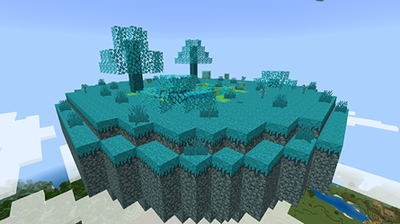
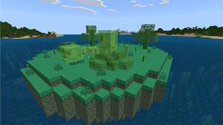
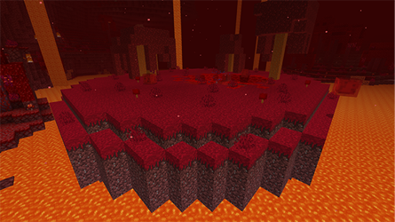
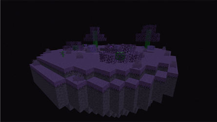

## Sky Slime Island

Skyslime Islands can be found floating above the terrain throughout the Overworld.

According to legend, Skyslimes were once invaders from another realm, though they now remain mostly confined to the areas surrounding these islands.

## Earth Slime Island

Earth slime Islands can occasionally be found in the oceans of the Overworld, appearing less alien than their Sky slime counterparts.

These islands serve as a reliable source for obtaining more of the common green Slime.

## Clay Island

Clay Islands are unusual compared to other slime islands, as they appear more like part of the Overworld than a slime-infested biome.

These islands are home to a strange type of clay-based slime I've named "Terracubes."

Terracubes can't jump very high and seem to only spawn on islands found in Mesa biomes.

## Scarlet Slime Island

Scarlet Islands can occasionally be found in the lava oceans of the Nether.

These islands are the only known habitat of the elusive Scarlet Slime.

## Enderslime Island

Enderslime Islands can be found scattered around the outer islands of the End, serving as breeding grounds for Enderslimes.

I believe that Skyslimes and Enderslimes were once the same species, but living in their separate environments has caused them to evolve differently.
