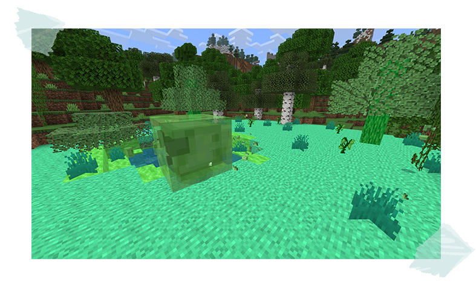
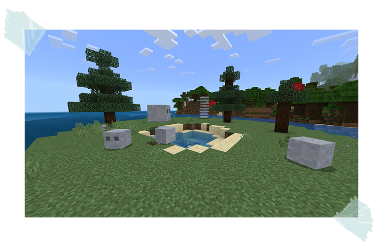
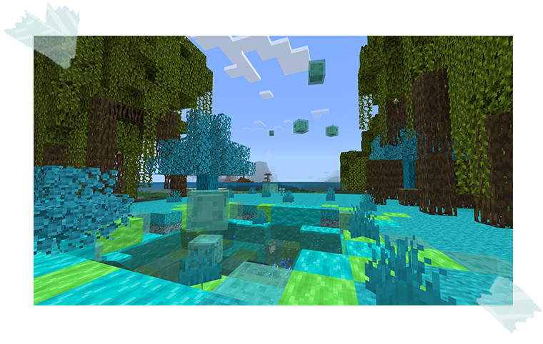
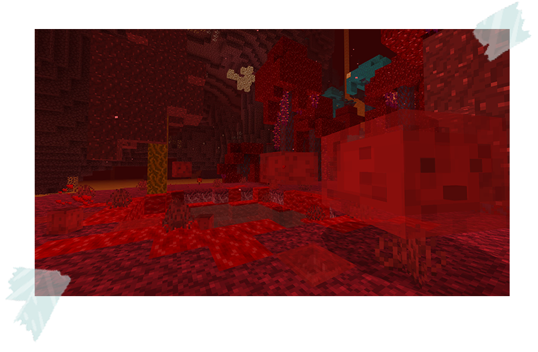
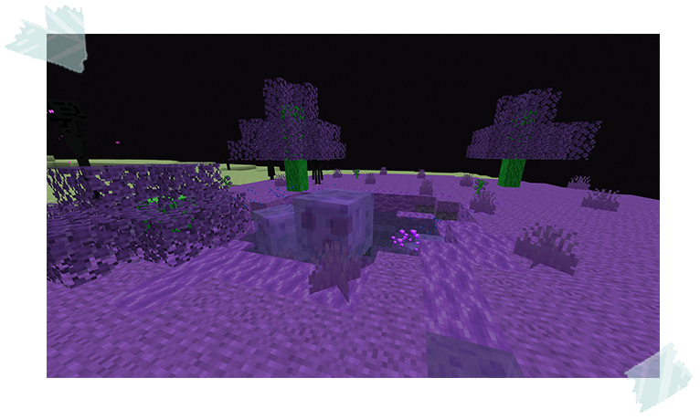
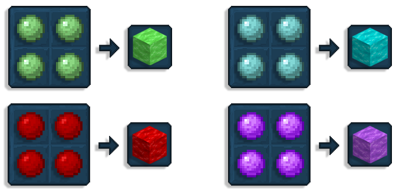
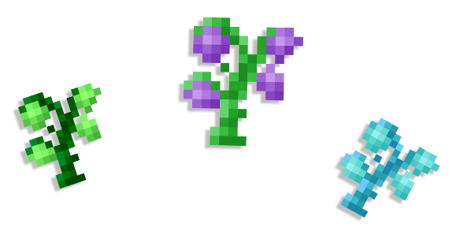
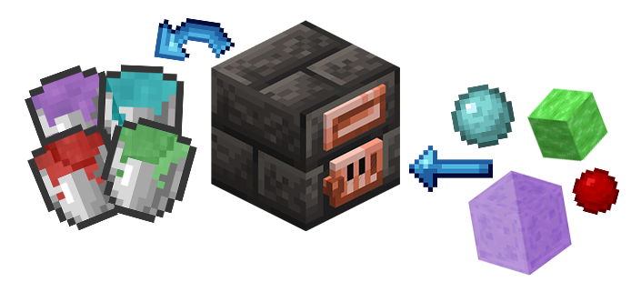

## Slime

Tinkers' adds new slimes into your world! Each boasts unique properties to elevate your gameplay.  
Dive in, discover their slimy secrets, and harness their power for tinkering triumphs!

Here's the you can find: 
 - [**Earth Slime**](#earth-slime)
 - [**Terracube**](#terracube)
 - [**Sky Slime**](#sky-slime)
 - [**Scarlet Slime**](#scarlet-slime)
 - [**Ender Slime**](#ender-slime)
 - [**Congealed Slime**](#congealed-slime)
 - [**Slime Sapling**](#slime-sapling)
 - [**Liquid Slime**](#liquid-slime)

### Earth Slime

Earth Slimes can be found naturally in Swamp biomes.

When killed, they drop Slimeballs.

### Terracube

The Terracube can be discovered when using a Terracube Bean on a Clay block.

This slime seems to be completely made out of clay.

When killed, they drop Clay Balls.

### Sky Slime

Sky Slimes are home to the Sky Slime Island. 

This type of slime can jump incredibly high, which means these slimes could attack you from above!

When killed, they drop Sky Slimeballs.

### Scarlet Slime

Scarlet Slimes can be found on a Scarlet Slime Islands.

These slimes have unique properties such as self-healing and they also glide when falling.

When killed, they drop Scarlet Slimeballs.

### Ender Slime

Ender Slime can only be obtained from growing an Ender Slime Bean on End Stone.

The island that forms is home to the Ender Slime, which when hurt, will teleport away randomly.

When killed, they drop Ender Slimeballs.

### Congealed Slime

Congealed Slime blocks can be crafted by combining Slimeballs in a 2x2 grid pattern.

These blocks can be melted in a Smeltery to create Liquid Slime.

### Slime Sapling

Slime Saplings can only be obtained from Slime islands that emerage when using Slime Beans.

They won’t grow naturally, they need to be forced grown using Bonemeal.

### Liquid Slime

You can create Liquid Slime by melting Slime in a smeltery setup.

Liquid Slime is primarily used for creating a new armour set, maybe other uses will be discovered in the future...
