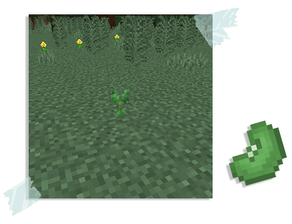
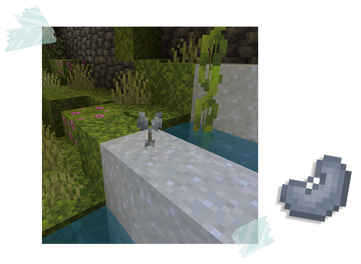
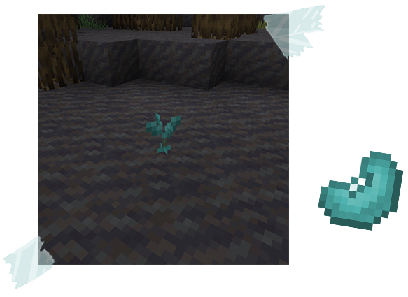
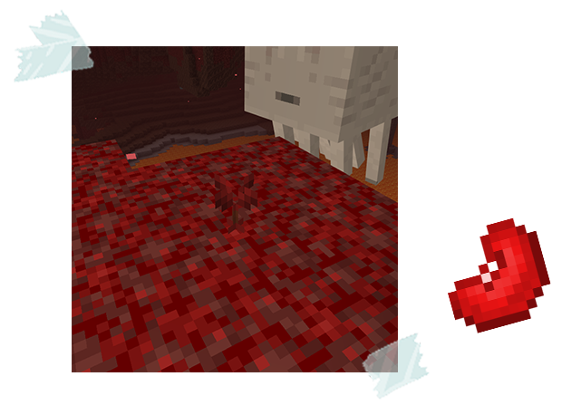
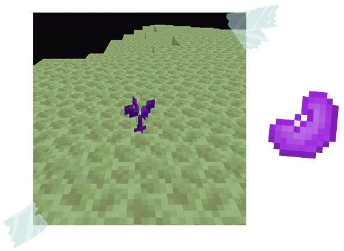

## Slime Beans

Slime Beans are more than just ordinary beans; they hold the magic to cultivate entire islands pulsating with slime! 

Planted correctly, these remarkable seeds sprout into wondrous Slime Islands, floating oases teeming with unique slimes and bountiful resources..

Here's the Beans you can find: 
 - [**Earth Slime Bean**](#earth-slime-bean)
 - [**Terracube Bean**](#terracube-bean)
 - [**Sky Slime Bean**](#sky-slime-bean)
 - [**Scarlet Slime Bean**](#scarlet-slime-bean)
 - [**Ender Slime Bean**](#ender-slime-bean)

### Earth Slime Bean

The Earthslime Bean can be found hidden within Tall Grass.

Once planted on Grass an Earthslime Bean sprout will emerge from the ground that’ll create an Earthslime Island!

### Terracube Bean

Hidden in Moss, you might find a strange clay-like bean, the Terracube Bean.

Plant it on some wet clay, and watch it sprout a tiny island that looks just like a piece of the Overworld, complete with Terracubes!

### Sky Slime Bean

Search for the Skyslime Bean nestled within Mud or clinging to Muddy Mangrove Roots.

Plant it in the mud, and watch a Skyslime Island sprout from the ground!

### Scarlet Slime Bean

Delve into the heart of the Nether to find the Scarletslime Bean.

Break Weeping Vines to discover these beans and plant them on Crimson Nylium, and watch a new Scarlet Island unfurl!

### Ender Slime Bean

This elusive Ender Bean lies hidden within End Stone.

Crack open a block, and you might just unearth this botanical treasure! This Bean can be planted on End Stone.
