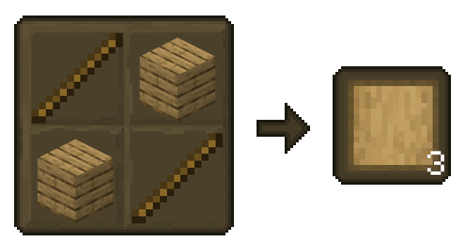
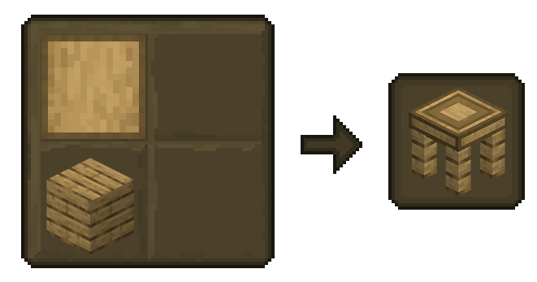
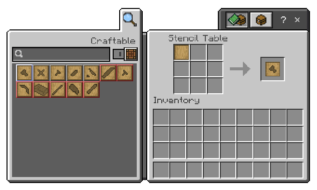
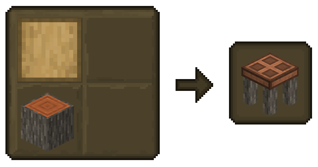
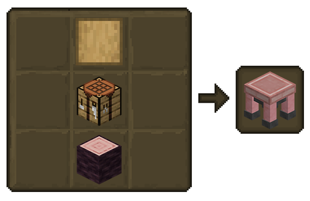
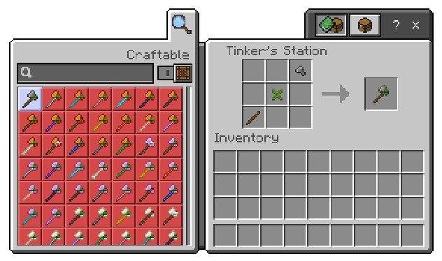

## Getting Started

Feeling overwhelmed by the possibilities in Tinkers' Construct? Don't worry, we've got you covered! This guide is designed to be a handy companion to your in-game experience.  Each section here mirrors the informative books you'll find within the Add-on itself.

Here's a list of what is covered in this section: 
 - [**Blank Patterns**](#blank-patterns)
 - [**Stencil Table**](#stencil-table)
 - [**Part Builder**](#part-builder)
 - [**Tinkers' Station**](#tinkers-station)

### Blank Patterns

In Tinkers' Construct, you'll rely on patterns extensively. 

These patterns are used to shape both the individual tool parts and the worktables you'll need for crafting.

### Stencil Table

The first step in your Tinkering adventure is to create a Stencil Table.

You'll need Blank Patterns for this, which you can craft from Planks.

Ready to forge your own path with the Stencil Table? Here's how:

1. Grab a Blank Pattern.
2. Open the Stencil Table.
3. Use the in-game crafting guide to find the desired tool part pattern.

### Part Builder

Now for the real fun! Once you've crafted some patterns, create the Part Builder. 

This essential tool station lets you turn your designs into functional parts.

Time to turn Patterns into Parts! Here's how:

1. Open the Part Builder.
2. Use the in-game crafting guide to find the desired tool part.
3. Select the corresponding soft material and Pattern from your inventory.

### Tinkers Station

Don't worry if you run out of patterns! 

Crafting more Blank Patterns is quick and easy.

TThe Forge Beckons... Craft Your First Tool!

You've conquered the initial steps of your tinkering journey! Now, it's time to unleash your creativity and forge your very first custom tool.

Don't be discouraged if it doesn't boast the ultimate power yet. Remember, this is just the beginning – a testament to your growing skills as a tinkerer!

Once you've meticulously crafted all the parts, head over to the Tinker Station. This is your workshop, where your designs materialize! Here, you can select the tool you envision and bring it to life with a simple press of a button.

While advanced modifications aren't available in the current version, keep your eyes peeled for future updates. The possibilities for customization are bound to expand!

*For Weapons like Swords or Cleavers, you will need a Tinkers' Anvil.*

### Tin Ore

Tinkers' Construct 3.0 introduces Tin as a new material. Tin One can be found deep underground, typically in the same layers where Copper One generates.

While Tin has a few uses, its primary purpose is to be combined with Copper to create the Bronze alloy.

Other uses include crafting Tin Cans and decorative Tin Blocks.

Tin comes in several forms: Raw Tin, Tin Nuggets, Tin Ingots, Tin Blocks, and Raw Tin Blocks.
