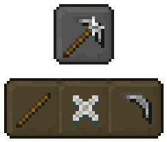
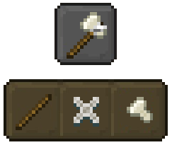
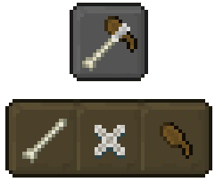
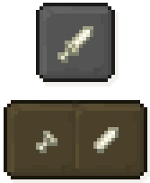
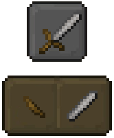
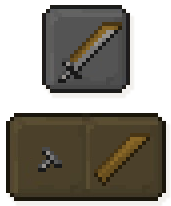

## Tools

Unleash your inner tinkerer and forge powerful tools in Tinkers' Construct! 

This Add-On allows you to craft and customize a wide variety of tools to fit your specific needs and playstyle. 

Here's a breakdown of the tools you can create: 
 - [**Pickaxe**](./tools.md#pickaxe)
 - [**Axe**](./tools.md#axe)
 - [**Shoel**](./tools.md#shoel)
 - [**Dagger**](./tools.md#dagger)
 - [**Sword**](./tools.md#sword)
 - [**Cleaver**](./tools.md#cleaver)
 - [**Bow**](./tools.md#bow)

## Damage

Tinkers' Construct handles tool damage a bit differently.
When you hover over a tool, you'll find its current damage displayed at the bottom of the tooltip.

Additionally, helpful notifications Will appear as your tool's durability drops, warning you when it reaches 10 and 1 durability remaining.

### Pickaxe

Dig it up with the Pickaxe!



The sturdy Pickaxe is your go-to tool for mining valuable ores and tough blocks like stone. 
It's not the fanciest tool, but it gets the job done, breaking blocks with ease. 

*Requires the Tinkers' Station to craft.*

### Axe

Chop & Defend with the Hand Axe!



This handy axe tackles wood and leaves, clearing paths and gathering resources. 
Doubles as a reliable weapon, making it a versatile companion.

*Requires the Tinkers' Station to craft.*

### Shoel

Multitasker Alert: The Shoel



This innovative tool combines the functionalities of a Shovel and a Hoe

Not only can you dig Dirt paths with ease, but you can also till the ground for planting by simply sneaking while using it.

*Requires the Tinkers' Station to craft.*

### Dagger

The Pocket Powerhouse: The Dagger



This compact weapon may be shorter than a sword, but it packs a punch in close combat. 

While not the strongest, the dagger is a reliable and versatile companion for any adventurer.

*Requires the Tinkers' Station to craft.*

### Sword

More Than Just a Weapon: The Sword



Sure, swords excel at vanquishing foes, but that's not all they can do! 

They also act as handy tools for swiftly breaking down things like bamboo and cobwebs, making them a versatile companion on your adventures.

*Requires the Tinkers' Anvil to craft.*

### Cleaver

Cleave Your Way to Victory: The Mighty Cleaver



This colossal cleaver isn't just for combat; it's a true warrior's multi-tool. 

Not only does it function as the ultimate defense against mobs, but its legendary sharpness allows you to collect mob heads, perfect for crafting and decorating. 

*Requires the Tinkers' Anvil to craft.*

### Bow

The Bow's Big Brother: The humble bow is a classic choice for ranged attacks.

But Tinker's' Bows ane the real deal! With a variety of materials and unique abilities, you can create bows that pack a serious punch.

*Bows are incompatible with Modifiers.

Like other tools, Bows can be crafted at the Tinker's Station.

The crafting recipe is a variation of the vanilla bow recipe.
Simply replace the Sticks with 3 Tool Handles of the same type.

```crafting table,Tinker's Station
- ftbtc:item/large_handle_bone string
ftbtc:item/large_handle_bone - string
- ftbtc:item/large_handle_bone string
result: ftbtc:item/bone_bow, 1
```
