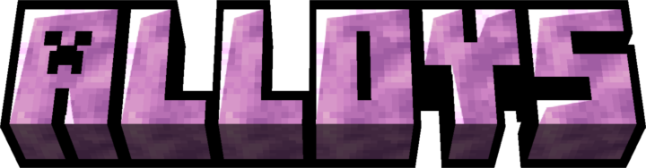
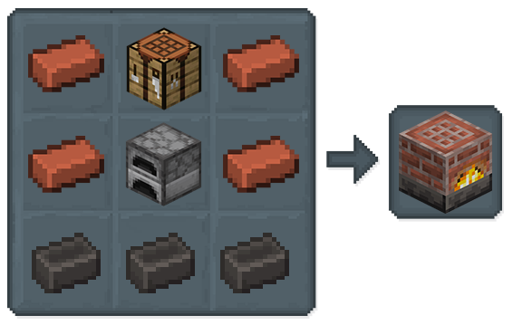

## Alloys

Crafting alloys has gotten a revamp! Instead of combining molten metals, you'll now create special alloy blends.

### Alloy Crafter

Looking to create Alloys? 

Look no further than the Alloy Crafter, a specialized crafting station designed for just that!

Get creative with the Alloy Crafter! This powerful crafting station lets you mix and match materials like Raw Iron, Scarlet Slime, and even honey to create brand new blends

*In this case, you can combine them to make Raw Pig Iron Blend, the first step towards crafting new tools!*