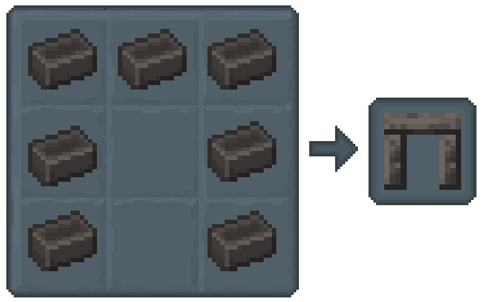
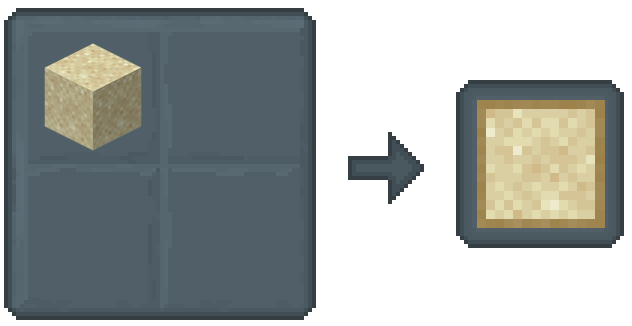
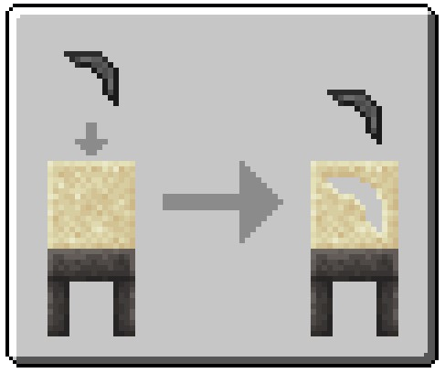
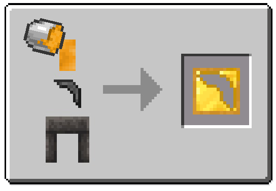
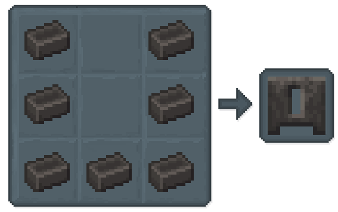

## Casting

Now you've gotten your metals nice and melted, and you know how to handle it safely.

Now. The fun part: Casting it into some useful tool parts!

- [**Casting Table**](#casting-table)
- [**Sand Casts**](#sand-casts)
- [**Gold Casts**](#gold-casts)
- [**Casting Basin**](#casting-basin)

### Casting Table

To craft tool parts for your weapons and tools in Tinkers' Construct, you'll need to use a Casting Table.

### Sand Casts

Creating a Tool Part with Casting:

1. **Craft a Sand Cast:** Craft a Sand Cast using 1 piece of Sand.

2. **Place Sand Cast in Table:** Put the Sand Cast on the Casting Table by interacting with it.

3. **Add Stone Part:** Craft a Stone tool part and then place it in the Casting Table with the Sand Cast using the interact button.

4. **Remove Stone Part:** Retrieve the Stone tool part by interacting with the Casting Table again.

5. **Pour Molten Metal:** Once the Casting Table is ready, pour a Copper Can of molten liquid into it using the interact button.

6. **Cool and Obtain Tool Part:** Let the metal cool down. Once cooled, interact with the Casting Table to remove and obtain your newly created tool part.

*Note: The Sand Cast will be consumed during this process and cannot be reused.*

*Note: Ingot Casts are made with Seared Bricks.*

### Gold Casts

The casting table lets you make reusable gold molds! Here's how:

1. Prep the Mold: Pick any stone tool part (pickaxe head, shovel blade, anything!) and place it on the casting table. This will be the shape for your new tools.

2. Cast in Gold: Pour a bucket of molten gold onto the casting table. Watch as the gold flows and takes the exact shape of your stone tool part!

3. Wait for it to Harden: Give the gold a moment to solidify and cool completely.

4. Pop Out the Stone: Once the gold hardens, carefully remove the stone tool part from the mold.

5. Your Reusable Mold is Ready! Now you have a brand new gold cast! This reusable mold lets you craft multiple tools, saving you time and resources.

### Casting Basin

The Casting Basin is your one-stop shop for creating solid blocks. 

Pour in any Bucket of molten metal, and it will solidify into a full-sized block.