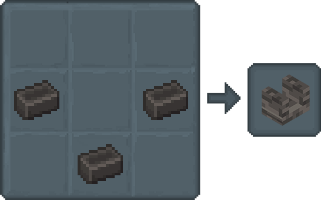

## Melting & More

Level up your Tinkering skills! You've mastered the basics, now get ready to craft amazing things;

- [**Grout and Seared Bricks**](#grout-and-seared-bricks)
- [**Seared Blocks**](#seared-blocks)
    - [**Seared Brick**](#seared-brick)
    - [**Seared Cobblestone**](#seared-cobblestone)
    - [**Seared Glass**](#seared-glass)
    - [**Seared Stone**](#seared-stone)
    - [**Seared Cracked Brick**](#seared-cracked-brick)
    - [**Seared Paver**](#seared-paver)
    - [**Triangle Seared Brick**](#triangle-seared-brick)

### Grout and Seared Bricks

Seared Bricks in a Flash:

1. Combine Clay, Sand, and Gravel to make Grout.

2. Smelt Grout in a Furnace for Seared Bricks.

3. Craft 4 Seared Bricks for a block.

*Bonus: Use a Stonecutter to unlock more looks!*

### Seared Blocks

#### Seared Brick

*Crafted in a Crafting Table.*

#### Seared Cobblestone

*Crafted in a Crafting Table.*

#### Seared Glass

*Crafted in a Crafting Table.*

#### Seared Stone

*Crafted in a Furnace.*

#### Seared Cracked Brick

*Crafted in a Furnace.*

#### Seared Paver

*Crafted in a Crafting Table.*

#### Triangle Seared Brick

*Crafted in a Crafting Table.*
 
**Tip:** *Pop these blocks in a Stonecutter for even more design options!*

#### Seared Faucet

For quick and direct pouring of molten liquid into Casting Tables and Basins, Seared Faucets are significantly faster than using cans.

Provided the liquid doesn't need to be moved or stored.

How to use:
1. Place a Faucet on the side of a Melter or Seared Drain.
2. Place either a Casting Table or Basin below it.
3. Interact with the Faucet to pour it out.
