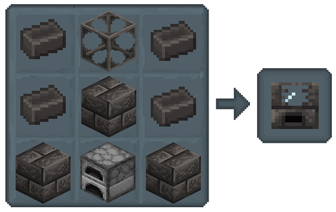
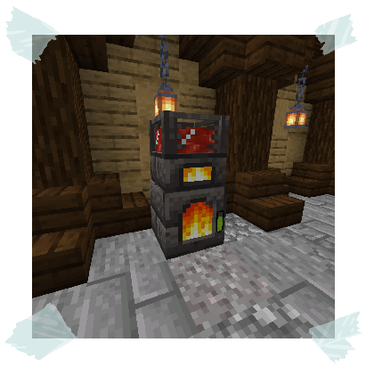

## The Melter

This is your basic Melter, perfect for getting started with simple tasks.

### How to use

This handy tool has two parts in one: the heater and the tank.

**Fuel Up:**
Interact with some Coal, Charcoal or lava to get the fire going.

The fuel will slowly go down over time, A bar shows how much fuel remains.

**Melt Some Ore:**
While fueled, interact with raw ore (like iron), and Watch as the molten metal fills the tank!

*The Melter is restriced to using tier 2 Materials;*
- Iron
- Gold
- Pig Iron
- Rose Gold