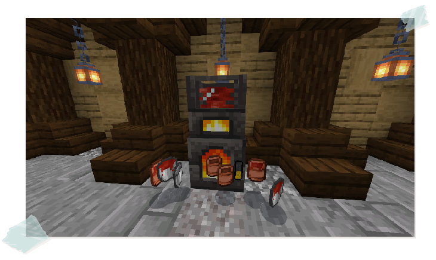
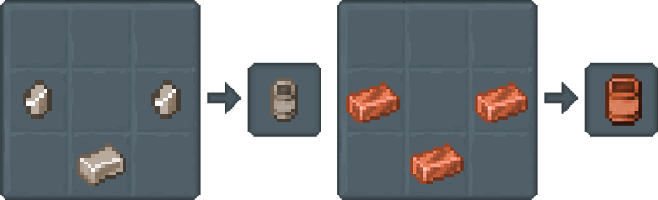

## Moving Liquids

You've got the hang of melting, Tinker! Now, the burning question: how do we get that molten metal out of there?

### Iron and Copper Cans

Need to transport, store, or pour your freshly melted liquids? 

Look no further than Iron & Copper Cans!

**Iron Cans** hold one-tenth the volume of a bucket, offering a tiny *100mB (or 100 millibuckets)* of storage.

However, **Copper Cans** hold one-fifth the volume of a bucket, offering a convenient *200mB* of storage.

*Lava can also be collected in Copper Cans*

### Buckets

For larger volumes of molten liquids, consider using **Buckets**.
 

They offer a generous *1000mB* of capacity, making them four times larger than copper cans.