## Tier 2 Materials

Use these materials to craft parts for your melee weapons and harvest tools!

Here's all the Tier 2 Materials: 
 - [**Iron**](#iron)
 - [**Gold**](#gold)
 - [**Pig Iron**](#pig-iron)
 - [**Rose Gold**](#rose-gold)

### Iron 
  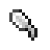   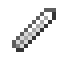 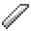

**Tool Head**
- Durability: 380
- Harvest Tier: Iron
- Mining Speed: 5
- Attack Damage: 1.75
- Trait: **Magnetic**

**Tool Handle/Guard**
- Durability: 1.05x
- Mining Speed: 0.85x
- Attack Damage: 1.05x
- Trait: **Magnetic**

### Bronze
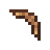 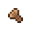 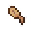  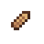 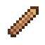 

**Tool Head**
- Durability: 380
- Harvest Tier: Diamond
- Mining Speed: 5
- Attack Damage: 1.75
- Trait: **Reinforced**

**Tool Handle/Guard**
- Durability: 1.05x
- Mining Speed: 0.85x
- Attack Damage: 1.05x
- Trait: **Reinforced**

### Gold 
 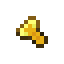 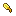    

**Tool Head**
- Durability: 65
- Harvest Tier: Gold
- Mining Speed: 9.5
- Attack Damage: 0.75
- Trait: **Speed**

**Tool Handle/Guard**
- Durability: 0.25x
- Mining Speed: 2.5x
- Attack Damage: 0.5x
- Trait: **Speed**

### Pig Iron 
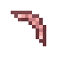 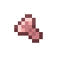 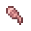   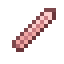 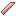

**Tool Head**
- Durability: 580
- Harvest Tier: Diamond
- Mining Speed: 6
- Attack Damage: 2.5
- Trait: **Tasty**

**Tool Handle/Guard**
- Durability: 1.1x
- Mining Speed: 0.85x
- Attack Damage: 1.1x
- Trait: **Tasty**

### Rose Gold 
 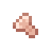     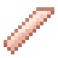

**Tool Head**
- Durability: 175
- Harvest Tier: Gold
- Mining Speed: 9
- Attack Damage: 1
- Trait: **Experienced**

**Tool Handle/Guard**
- Durability: 0.6x
- Mining Speed: 1.2x
- Attack Damage: 1x
- Trait: **Experienced**
