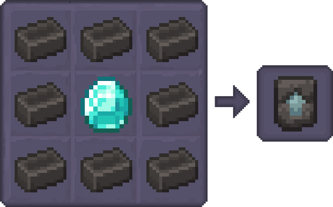
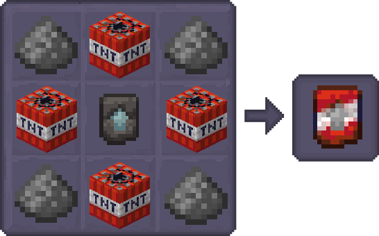
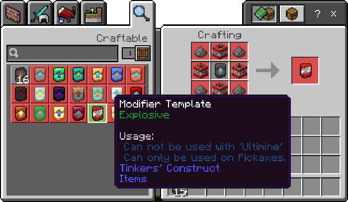
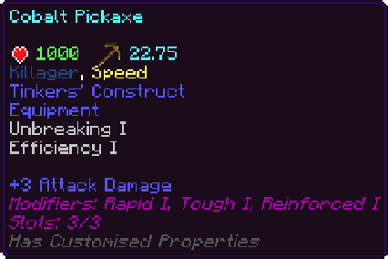

Modifiers grant unique abilities to your tools and weapons, though strangely, they don't seem to work with any throwable items.

### Modifier Template

The first step is to learn how to create a Modifier Template. Think of this as the foundation for all your future Modifiers.

## Crafting modifiers

To create any Modifier, we always start with a Modifier Template and surround it with the required materials.

For example, to make an Explosive Modifier, we'll infuse the Template with TNT and Gunpowder.

*All recipes can be crafted at a Crafting Table.

---

All Modifiers will be displayed in the in-game crafting menu for easy access.

Simply search for 'Modifier' or use a Modifier Template to view available options.

### Modifiers

- Bane 
  - Adds the "Bane of the Arthropods" Enchant, Can be stacked. Just swords and axes. Max level 3.
- Bright
  - A light source follows the player while equiped. Can not be used with "Soaked" or "Sponged".
- Electrifying
  - A chance to summon lightning when hitting mobs. Can only be used on swords.
- Explosive
  - Gives the ability to mine a 3x3 area. Can not be used with "Ultimine". Can only be used on Pickaxes.
- Lucky
  - Adds the "Looting/Fortune" Enchant. Max level 3. Can't be used with Silk Touch. 
- Pushed
  - Adds the "Knockback" Enchant, Can be stacked. Can only be used on Daggers, Swords or Cleavers. Max level 2.
- Rapid
  - Adds the "Haste" Enchant, Can be stacked. Can not be used on throwables or slings. Max level 3
- Reinforced
  - Adds the "Unbreaking" Enchant, Can be stacked. Can not be used on throwables or slings. Max level 3.
- Sharp
  - Adds the "Sharpness" Enchant, Can be stacked. Can not be used on throwables or slings.
- Silky
  - Adds the "Silk Touch" Enchant. Can not be used on throwables or slings. Can't be used with Fortune.
- Smitey
  - Adds the "Smite" Enchant, Can be stacked. Can only be used on Daggers, Swords or Cleavers. Max level 3.
- Soaked
  - Gives the player "Water Breathing" effect while equiped. Can not be used with "Sponged" or "Bright". Can not be used on throwables or slings. Not stacked, it's an effect.
- Sponged
  - Allows the player to absorb water within a 3x3 radius while equiped. Can not be used with "Soaked" or "Bright".
- Starstruck
  - Has a 5% chance to drop a Netherstar when defeating hostile mobs. Can only be used on Daggers, Swords or Cleavers.
- Steal
  - When a player attacks mobs they get the "Regeneration" effect. Can only be used on Daggers, Swords or Cleavers.
- Tough
  - Gives the player "Resistance" effect while equiped. Max level 3.
- Ultimine
  - Adds the ability to chop trees by breaking just one log, also adds the ability to break clusters of ores when mining. Can not be used with "Explosive". Can only be used on Pickaxes or Axes.

--- 

You can combine a variety of Modifiers to create epic Tools and Weapons.

Keep in mind that Modifiers are exclusive to Tinkers' Construct items.

They won't work with Vanilla Minecraft items or items from other mods, and they can't be applied to Slings, Throwables, or Bows.

*An example of 3 Modifiers on a single tool.
