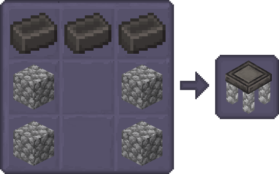
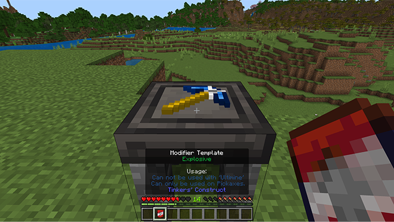
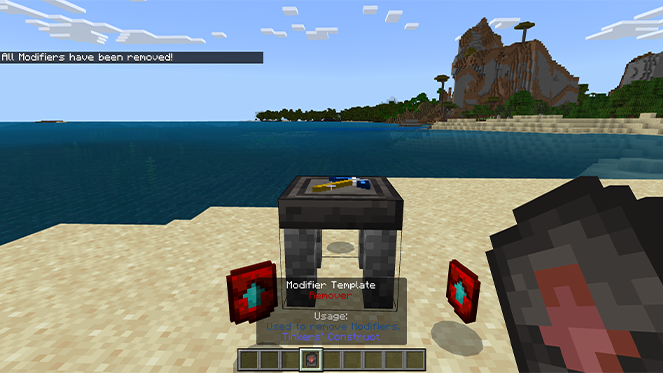
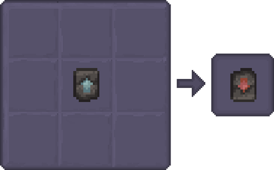

Once you’ve crafted your Modifiers, you’ll need a Modifier Worktable to apply them to your weapons and tools.

A Modifier Worktable can be crafted using Seared Bricks and any of these stone types:

Andesite, Basalt, Cobblestone, Cobbled Deepslate, Diorite, Granite, Mossy Cobblestone, or Stone.

## How to Use the Modifier Worktable

- Set up your Workbench: Place your Modifier Workbench wherever you'd like.
- Choose your Tool or Weapon: Select a Tinkers' Tool or Weapon (except Bows, Slings, and Throwables).
- Place your Item: Put the chosen item on the Workbench.
- Pick your Upgrade: Choose a Modifier to enhance your item.
- Supercharge your Gear: The Modifier will be added to your item.
- Grab your Gear: Take your modified item from the Workbench.

### Removing modifiers

Need to remove a Modifier or accidentally applied the wrong one? Don't worry, removing them is as simple as adding them.

Place Your Tool: Position your tool on the Modifier Worktable.
Equip the Remover: Equip the Modifier Remover in your main hand.
Interact: Interact with the Modifier Remover.
Watch the Magic: The previously added modifiers will be removed, and the Modifier Remover will be consumed.

#### Modifier Remover

Crafting Modifier Removers is easy: just place an empty Modifier into a Crafting Table.

Remember, these are one-time use items, so use them wisely.
