## The Smeltery

The Smeltery isn't your average furnace. This multi-block beast unlocks advanced processing for your ores and materials. But unlike a simple Melter, the Smeltery requires specific components arranged just right. 

Let's break down what you'll need to build your very own smelting powerhouse!

- [**Smeltery Controller**](#smeltery-controller)
- [**Seared Tank**](#seared-tank)
- [**Seared Drain**](#seared-drain)
- [**Building the Smeltery**](#building-the-smeltery)
- [**Using the Seared Tank**](#using-the-seared-tank)
- [**Using the Smeltery Controller**](#using-the-smeltery-controller)
- [**Using the Seared Drain**](#using-the-seared-drain)
- [**Final Notes**](#using-the-smeltery-final-notes)

### Smeltery Controller

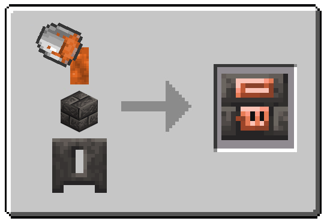

**Crafting a Smeltery Controller**

1. Fill a Casting Basin with a Seared Brick Block.

2. Pour Molten Copper from a Bucket onto the Seared Brick Block.  

3. Let the Copper cool completely.  

*Once cooled, the Seared Brick Block will have transformed into a Smeltery Controller. and you can revove it from the Basin*

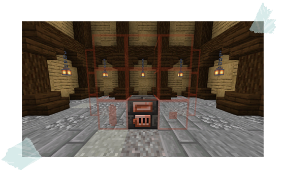

**Bring Your Smeltery to Life!**

With your Smeltery Controller crafted, it's time to set the stage for your new melting station. Find a spacious area, at least 7x7 blocks wide.

**Here's the magic:** When you place the Controller, it will transform the surrounding area with a helpful red outline. This outline acts as a guide, showing you exactly where to position the seared bricks to complete your smeltery.

### Seared Tank

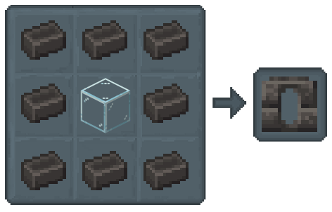

Smelteries need a steady supply of heat to melt metals. That's where tanks come in! These handy containers hold the fuel, typically **Lava** or **Blazing Lava**, that keeps your smeltery running.

**Fuel Options:** You can fill your tank with Lava Buckets or even Cans.

**Smeltery Placement:** Tanks connect to the Smeltery in a specific spot – the bottom left slot at the front.

*Tip: While tanks are great for fueling your smeltery, they're also versatile! You can use them to store water for other purposes.*

### Seared Drain

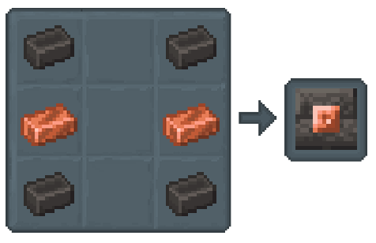

The Seared Drain is the key to extracting all those molten metals you've been working hard to create in your smeltery.

Think of it as a faucet!  You can use buckets or even cans to collect the molten goodness.

**Here's the thing to remember about placement:** Seared Drains have a designated spot – *the bottom right slot at the front of the smeltery.* 

Just put it there, and it will automatically connect to the smeltery controller, ready to dispense your liquid metals.

### Building the Smeltery

1. **Gather your Seared Bricks:** Make sure you have enough seared bricks to create a 3x3 square.

2. **Dig Down:** For a cleaner look, you can dig a one-block deep hole where you want your smeltery to be.

*This will make the base level with the surrounding floor.*

3. **Place the Seared Bricks:** In the chosen location (or in the hole you dug), carefully arrange your seared bricks in a 3x3 pattern.

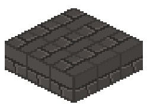

4. **The Controller Takes Charge:** With your 3x3 seared brick base complete, it's time to place the Smeltery Controller. 

Find a spot on one of the sides, right in the middle of the second row (one block above the base). 

Put the Controller down, and watch it work its magic!

5. **Ready, Set, Drain!:** Now for the Seared Drain. This goes right next to the Controller, on its right side in the same row.

6. **Fueling the Fire:** On the left side of the Controller, place your Seared Tank. This will be your fuel reservoir..

7. **Walling It In:** Now that the core components are placed, continue building the walls of your smeltery using seared bricks. 

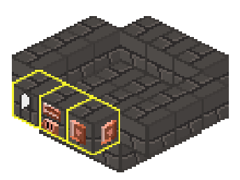

8. **Stacking Success:** Now that you have the base and core components in place, let's add another layer of seared blocks! 

Carefully place these blocks on top of your existing structure, creating a second level.

***Seared Block Variety (Optional):*** While seared bricks are the most common choice, feel free to get creative! 

You can use any type of seared block you like, such as seared glass or seared stone.

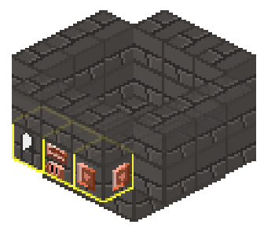

9. **Capping It Off:** This is it, the final touch! Place the last layer of seared blocks on top of your second level, completing the outer frame of your smeltery.

As soon as the final block is placed, poof!  The red outline will magically disappear. 

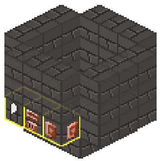

***Congratulations!, your very own smeltery is now complete and ready to unleash its fiery potential!**

### Using the Seared Tank

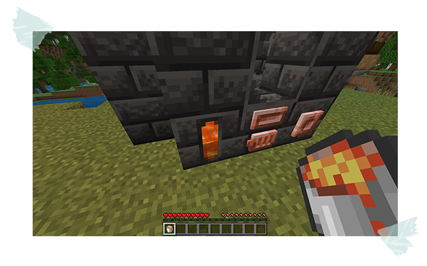

With your smeltery constructed, it's time to unleash its fiery potential. 

But first, you'll need to provide some fuel to get the molten metal flowing.

1. Grab a Bucket or Can of Lava, and interact with the Seared Fuel Tank. 

Watch as the tank fills up, ready to power your smelting adventures!

### Using the Smeltery Controller

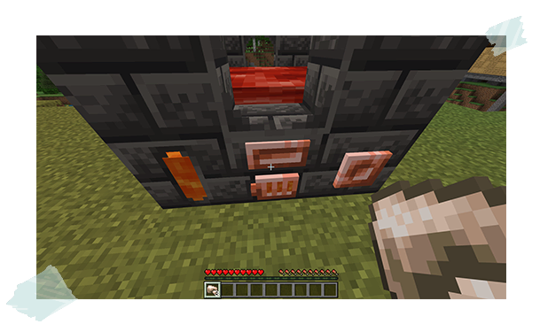

Make sure your Seared Tank is filled with lava to keep the heat on.

1. With a steady supply of fuel, interact with the ore or alloy you want to melt from your inventory, 

and watch as your chosen material melts. 

*Some fuel will be consumed to keep the process going.*

### Using the Seared Drain

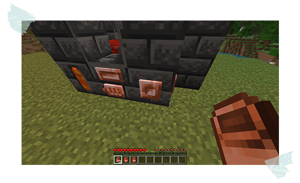

The drain acts as a tap for your smeltery, Here's how to use it.

1. Make sure you have an empty Copper Can or Bucket in your hand.

2. Simply interact with the Seared Drain while holding your empty container. 

The molten metal will flow out, filling your container and ready for use in crafting!

### Using the Smeltery: Final notes

You've mastered the basics of the smeltery! Now, for a few extra pointers to make you a true smelting pro:

**Fixed Size for Big Results:** The Smeltery has a fixed size, meaning its overall dimensions can't be changed. However, you can customize the blocks used and their placement.

Want to build it with three tanks and two drains? Go for it!
Prefer a smeltery made entirely of seared glass? That works too.

**Using Faucets:** Faucets can be attached to Seared Drains, but they'll only work if there's a Casting Table or Basin placed directly beneath them.
