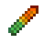
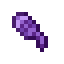
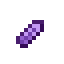
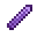
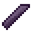
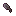
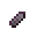
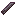

## Tier 4 Materials

Blaze Lava is required for tier 4 smelting swap to [**Blaze Lava**](./the_nether.md#blazing-lava) for these tougher materials.

Use these materials to craft parts for your melee weapons and harvest tools!

Here's all the Tier 4 Materials: 
 - [**Queens Slime**](#queens-slime)
 - [**Manyullyn**](#manyullyn)
 - [**Hepatizon**](#hepatizon)
 - [**Netherite**](#netherite)   

### Queens Slime
      

**Tool Head**
- Durability: 1650
- Harvest Tier: Netherite
- Mining Speed: 6
- Attack Damage: 2

**Tool Handle/Guard**
- Durability: 1.35x
- Mining Speed: 0.9x
- Attack Damage: 0.95x

**Trait**: Bounce

### Manyullyn
      

**Tool Head**
- Durability: 1250
- Harvest Tier: Netherite
- Mining Speed: 6.5
- Attack Damage: 3.5

**Tool Handle/Guard**
- Durability: 1x
- Mining Speed: 1.1x
- Attack Damage: 1x

**Trait**: Plunder

### hepatizon
      

**Tool Head**
- Durability: 975
- Harvest Tier: Netherite
- Mining Speed: 8
- Attack Damage: 2.5

**Tool Handle/Guard**
- Durability: 1.1x
- Mining Speed: 1.2x
- Attack Damage: 0.9x

**Trait**: Floaty

### Netherite
      

*Molten Netherite can only be poured into blocks or ingots, for all other parts Diamond must be upgraded in a Smithing Table.*

**Tool Head**
- Durability: 1420
- Harvest Tier: Netherite
- Mining Speed: 8
- Attack Damage: 3

**Tool Handle/Guard**
- Durability: 2.5x
- Mining Speed: 1.8x
- Attack Damage: 2x

**Trait**: Guarding
