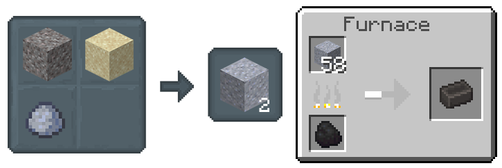
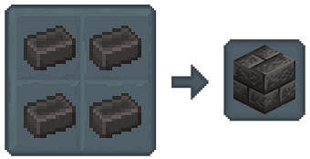
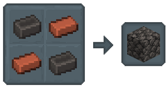
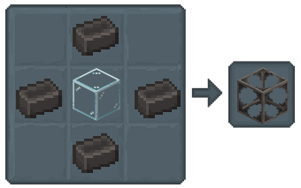
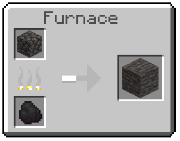
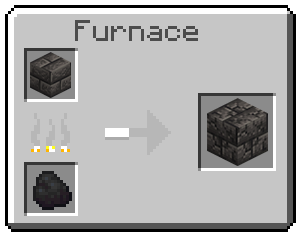
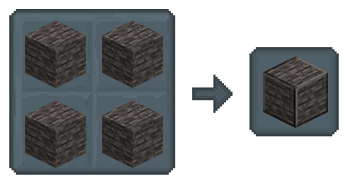
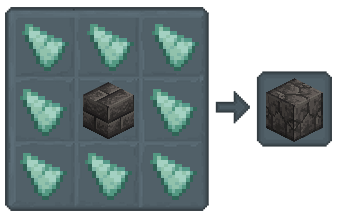

## Melting & More

Level up your Tinkering skills! You've mastered the basics, now get ready to craft amazing things;

- [**Grout and Seared Bricks**](./melting_and_more.md#grout-and-seared-bricks)
- [**Seared Blocks**](./melting_and_more.md#seared-blocks)
    - [**Seared Brick**](./melting_and_more.md#seared-brick)
    - [**Seared Cobblestone**](./melting_and_more.md#seared-cobblestone)
    - [**Seared Glass**](./melting_and_more.md#seared-glass)
    - [**Seared Stone**](./melting_and_more.md#seared-stone)
    - [**Seared Cracked Brick**](./melting_and_more.md#seared-cracked-brick)
    - [**Seared Paver**](./melting_and_more.md#seared-paver)
    - [**Triangle Seared Brick**](./melting_and_more.md#triangle-seared-brick)

### Grout and Seared Bricks

Seared Bricks in a Flash:

1. Combine Clay, Sand, and Gravel to make Grout.

2. Smelt Grout in a Furnace for Seared Bricks.

3. Craft 4 Seared Bricks for a block.

*Bonus: Use a Stonecutter to unlock more looks!*

### Seared Blocks

#### Seared Brick

*Crafted in a Crafting Table.*

#### Seared Cobblestone

*Crafted in a Crafting Table.*

#### Seared Glass

*Crafted in a Crafting Table.*

#### Seared Stone

*Crafted in a Furnace.*

#### Seared Cracked Brick

*Crafted in a Furnace.*

#### Seared Paver

*Crafted in a Crafting Table.*

#### Triangle Seared Brick

*Crafted in a Crafting Table.*
 
**Tip:** *Pop these blocks in a Stonecutter for even more design options!*

[ **Previous Page**](./tool_repairs.md) / [**Next Page** ](./melter.md)

[**Back to the Top**](./melting_and_more.md#melting--more)