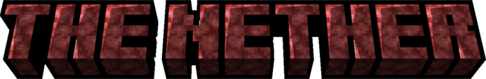
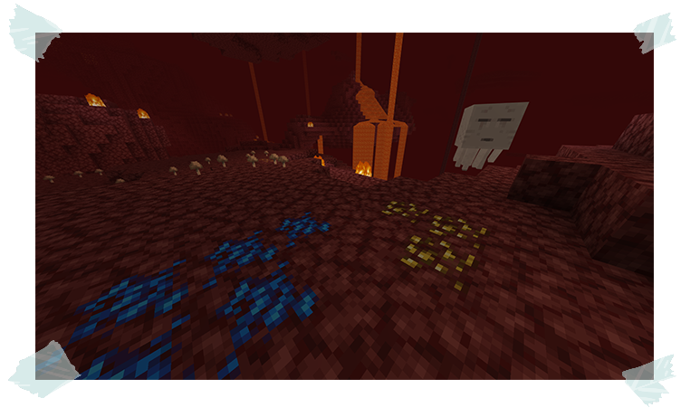

## The Nether

Braving the fiery depths of the Nether? Prepare to unearth some truly unique treasures! 

Here's the lowdown on two new ores exclusive to this infernal dimension:

### Ardite and Cobalt:

These rare ores are closely associated with Piglin settlements. 

Keep an eye out for them while exploring Nether Wastes near Piglin activity.

*Unlike most ores, **Ardite and Cobalt** can also spontaneously appear in previously explored areas.*

Hunting for treasure in the Nether? Keep an eye out for Ardite and Cobalt ores poking out of the Netherrack. 

These shiny surprises are uncommon, so watch closely!

### Blazing Lava

Regular lava just doesn't cut it when it comes to high-tier materials. 

But fear not, Blaze Lava, burning far hotter than its regular counterpart, is the answer to your melting woes. 

Here's how to craft this essential ingredient:

1. First, you'll need a Blaze Head. These can be obtained by defeating a Blaze in the Nether with a Cleaver

2. Place the Blaze Head inside the Casting Basin.

3. Pour regular lava onto the Blaze Head. The transformation will be almost instant – the lava will supercharge, turning into Blaze Lava!

4. With your empty bucket at the ready, scoop up the Blaze Lava. This scorching liquid is crucial for melting those coveted tier 4 materials!

[ **Previous Page**](./the_smeltery.md) / [**Next Page** ](./tier_3.md)

[**Back to the Top**](./the_nether.md#the-nether)