## Tier 1 Materials

The possibilities are endless! Experiment with these materials in the Part Builder to forge unique parts for your melee weapons and harvest tools.

### Wood
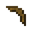  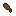  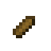 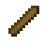 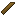
**Tool Head**
- Durabilty: 60
- Harvest Tier: Wood
- Mining Speed: 2
- Attack Damage: 0
- Trait: Cultivation

**Tool Handle/Guard**
- Durabilty: 1x
- Attack Damage: 1x

**Trait**: Cultivation

### Stone
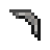 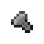    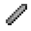 
**Tool Head**
- Durabilty: 130
- Harvest Tier: Stone
- Mining Speed: 4
- Attack Damage: 1

**Tool Handle/Guard**
- Durabilty: 0.9x
- Attack Damage: 1x

**Trait**: Summoner

### Bone
 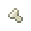 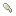  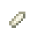 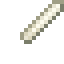 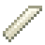
**Tool Head**
- Durabilty: 100
- Harvest Tier: Stone
- Mining Speed: 2.5
- Attack Damage: 1.25
- Trait: Undead

**Tool Handle/Guard**
- Durabilty: 0.75x
- Attack Damage: 1x

**Trait**: Undead

### String
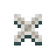
**Binding**
- Holds your tools together.

**Trait**: Stringy