## Tier 3 Materials

Use these materials to craft parts for your melee weapons and harvest tools!

Here's all the Tier 3 Materials: 
 - [**Amethyst Bronze**](./tier_3.md#amethyst-bronze)
 - [**Diamond**](./tier_3.md#diamond)
 - [**Cobalt**](./tier_3.md#cobalt)
 - [**Slimesteel**](./tier_3.md#slimesteel)
 - [**Ardite**](./tier_3.md#ardite)

### Amethyst Bronze
 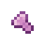 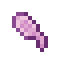  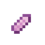  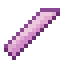

**Tool Head**
- Durability: 720
- Harvest Tier: Diamond
- Mining Speed: 7
- Attack Damage: 1.5

**Tool Handle/Guard**
- Durability: 1x
- Mining Speed: 0.7x
- Attack Damage: 1x

**Trait**: Soulbound

### Diamond
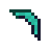 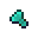 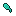    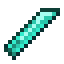

**Tool Head**
- Durability: 1280
- Harvest Tier: Diamond
- Mining Speed: 7.5
- Attack Damage: 2.75

**Tool Handle/Guard**
- Durability: 2.25x
- Mining Speed 1.6x
- Attack Damage: 1.75x

**Trait**: Diamond

### Cobalt
  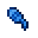   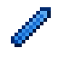 

**Tool Head**
- Durability: 800
- Harvest Tier: Diamond
- Mining Speed: 6.5
- Attack Damage: 2.25

**Tool Handle/Guard**
- Durability: 1.05x
- Mining Speed 1x
- Attack Damage: 1x

**Trait**: Killager

### Slimesteel
  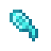  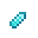 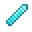 

**Tool Head**
- Durability: 1040
- Harvest Tier: Diamond
- Mining Speed: 6
- Attack Damage: 2.5

**Tool Handle/Guard**
- Durability: 1.2x
- Mining Speed 1x
- Attack Damage: 1x

**Trait**: Stuck

### Ardite
  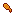    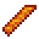

**Tool Head**
- Durability: 500
- Harvest Tier: Netherite
- Mining Speed: 8
- Attack Damage: 3.5

**Tool Handle/Guard**
- Durability: 1.05x
- Mining Speed 1x
- Attack Damage: 1x

**Trait**: Smelting

[ **Previous Page**](./the_nether.md) / [**Next Page** ](./tier_3_traits.md)

[**Back to the Top**](./tier_3.md#tier-3-materials)