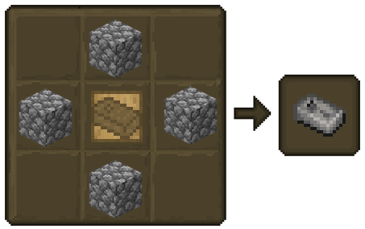
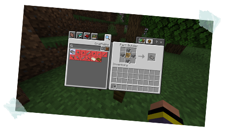
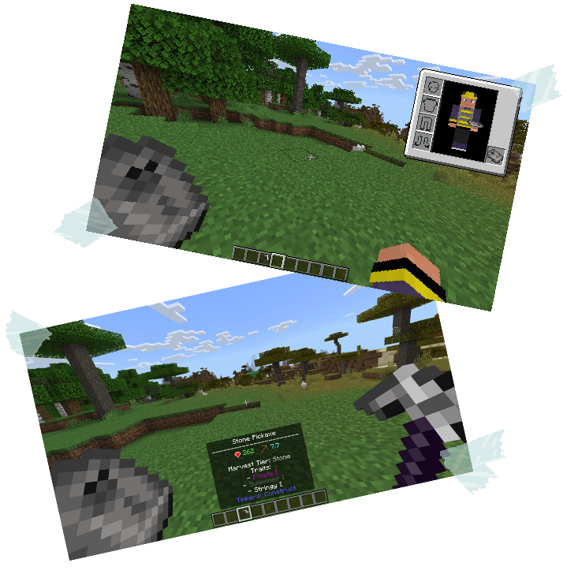

## Tool Repairs

Tinkers' Construct ditches the vanilla anvil repair system. Instead, you need to craft repair kits specifically for your Tinkers' tools.

Here are the Tier 1 Traits: 
 - [**Repair Kits**](./tool_repairs.md#repair-kits)
 - [**Repairing Tools**](./tool_repairs.md#repairing-tools)

### Repair Kits

Use tool repair kits to restore the health of your weapons and tools.

*Use the Part Builder to craft these low tier kits*

### Repairing Tools

Repairing Tools in Tinkers' Construct: A Step-by-Step Guide

1. You'll need a Part Builder to craft a repair kit that matches the material of your tool (e.g., a Stone repair kit for a Stone tool).

2. Equip the repair kit in your main hand.

3. Click anywhere to use the repair kit. This will automatically move it to your off-hand.

4. Equip the tool you want to repair in your main hand.

5. Click anywhere again while holding the tool. 

This will consume the repair kit and restore the durability of your tool.

*Additionally, helpful notifications will appear as your tool's durability drops, warning you when it reaches 25, 10 and 1 durability remaining. Aim to repair your tools before they break completely.*

[ **Previous Page**](./tier_1_traits.md) / [**Next Page** ](./melting_and_more.md)

[**Back to the Top**](./tool_repairs.md#tool-repairs)