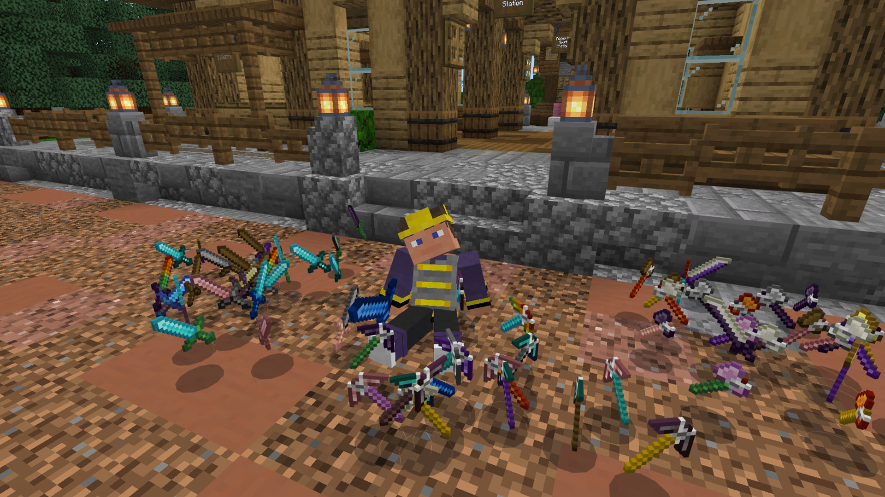

 
## **Tinkers' Construct Add-on Wiki**

This wiki is your one-stop shop for all things **Tinkers' Construct for Minecraft Bedrock (Marketplace)** Dive deep into crafting unique tools, weapons, and gadgets to enhance your Minecraft experience.

This wiki focuses specifically on content found in the add-on for the Marketplace version of Tinkers' Construct, which may differ from the original mod or other versions.

### Where can i download Tinkers' Construct?

Thats easy! you can get it [**Here**](https://go.ftb.team/tinkers-addon) from the Minecraft Marketplace. for 🪙990 Minecoins

### What is Tinkers' Construct?

Originally a beloved Java mod by *mDiyo*, Tinkers' Construct lets you craft seriously awesome weapons and tools that pack a punch.

But it's not just about bashing things. Tinkers' Construct throws in a whole new system, the Smeltery, for processing your ores like a pro. Plus, there's a treasure trove of gadgets, items, blocks, and even some new mobs to keep things interesting.

*FTB* brought all this goodness to the **Bedrock Edition** of Minecraft, so console and mobile players can join the fun.  

While it's not a perfect copy of the original Java mod, it keeps the core ideas that make Tinkers' Construct awesome.  Get ready to craft, fight, and explore in a whole new way!

[**Next Page**](./getting_started.md)