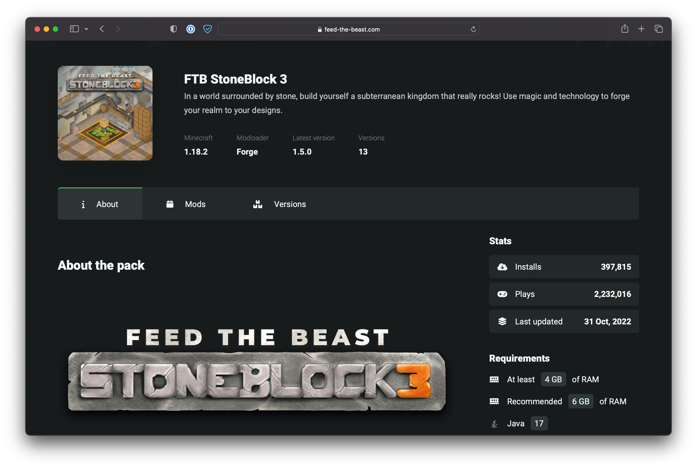
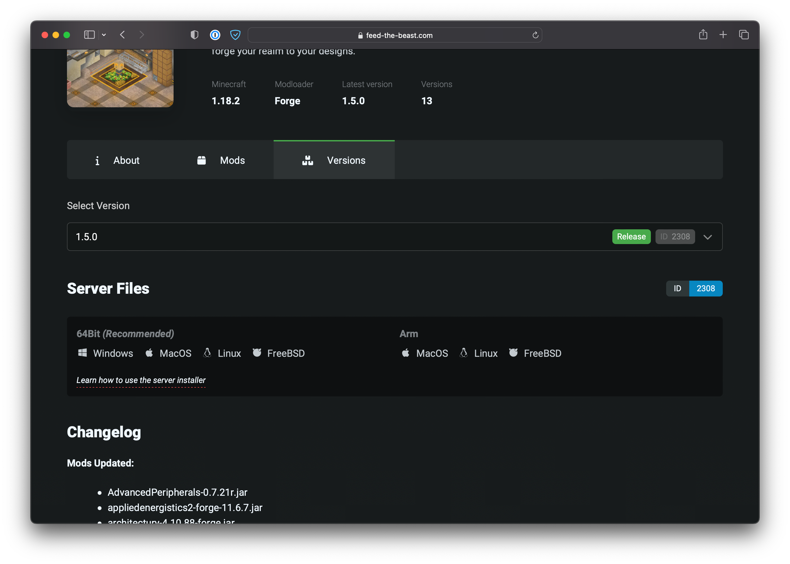

# How to create a Minecraft Server for any FTB Modpack

Creating a server for an FTB Modpack is a little different from most other Modpack providers. To help you through these differences we've outlined each step in detail below.

::: tip Disclaimer
This guide is only intended to show you how to download the files required to setup a Minecraft server for an FTB modpack. This guide will not help you run a Minecraft Server. There are many other guides out there on how to do this.
:::

## Downloading the server files

Unlike other providers, FTB ships a single binary file (executable) that contains a system that can download, update, and extract out all the Modpack files from our servers.

This tool is called the `Server Installer` and each Modpack has one on it's modpack's page. 

For the reminder of this guide, we're going to use `FTB StoneBlock 3` Modpack from FTB as the Modpack we're going to setup a server for.

### Locating the Server files

Right, now that's out of the way, here are the steps to locate the server files.

- Go to the [FTB Website](https://feed-the-beast.com)
- Find the modpack you want to install, in this case, it's going to be `FTB StoneBlock 3`

You should now be on a page that looks like this

- Next, select Versions in the tabs under the Modpack name
- Then under selected version, select the version you need a Minecraft server for.
  - Typically, the latest version is the one you'd need
- Under the selected version, you'll see a big heading tilted `Server Files`
- Select the option that is correct for your operating system. We provide both ARM and Intel/AMD binaries.

Now you have this downloaded, we can move onto how to use the server installer

::: warning
Do not rename this file! The server installer uses the file name to know which pack to install! If you do modify the file's name. You will be asked for the pack ID and version ID.
:::

## Using the server installer

### Windows

Using the server installer on windows couldn't be simpler. Just put file you downloaded from above into the folder you'd like to have the server install to and double-click the .exe you downloaded. This will asked you some basic questions, then install the server. Once the tool has finished, you can use the `run.bat` file that has been placed in that folder to start the server!

### Mac & Linux

As with all good things, Mac & Linux have to make it a bit more complicated. You'll need to experience with the terminal to progress here. We'll try and help out as much as possible but it's worth noting that terminal experience is **required** for running a Modded Minecraft Server.

1. Create a new folder in the location you'd like to install the server to.
2. Place the downloaded file into location you created above.
3. Open the Terminal (In Linux (and sometimes MacOS) you should be able to right-click in this folder and click `open in terminal`. If this is present, you can skip step 3)
   - If you're running a Linux server with no Desktop. We expect you to know how to get to `step 4`.
4. `cd` into the folder that you created in `step 1`. For example, if I created a folder at `/home/mikey/servers/Stoneblock3` I would then use the following command `cd /home/servers/Stoneblock3`
5. Now that you are in the right folder you will need to give the server installer `execution` permissions. You do this by running the following command.
   - `chmod +x serverinstaller_{id}_{versionid}` replace the `{id}` and `{versionid}` with the numbers present in your file name.
6. Finally, run `./serverinstaller_{id}_{versionid}` again, replacing the `{id}` and `{versionid}` with the correct numbers.
7. You will now be asked some questions, answer them and the installer should start installing the pack.
8. You're done! You can now use the `run.sh` to start the server.

## Troubleshooting

::: details How do I use terminal!
We won't guide you through this as it's easily google-able, just google it :D 
:::

::: details How do I do X on the server
This guide is only intended to help you create the server. Using the server is up to you to research and learn.
:::

::: details The server installer failed
If for any reason the server installer stopped working. You will want to create an issue on our Github which can be [found here](https://github.com/CreeperHost/modpacksch-serverdownloader/issues).
:::

::: details Why can't you just offer a .zip file
This is a question we see pop up occasionally. The reason we do it this is way is that we can hot fix modpacks without having to ship out a new version. Say a file is missing from a version, we can just patch this in and the FTB App and the server installer with automatically know to use this new file. This is super handy for anyone involved.

We also do it this way to reduce load on our servers. Having 100k+ people downloading a 500mb+ every couple of seconds is a big strain on our systems. The server installer uses heavily cached files from our distribution system which dramatically reduces the load on our systems. 
:::

::: details What if I don't want to use your `run.sh`
No problem, just delete it and make your own. Just make sure you include the right arguments to Java
:::

## This all seems a bit complicated... <Badge type="tip" text="Ad" vertical="middle" />

We 100% agree! Running a server is no trivial task... If all this seems like too much of a pain in the rear end, maybe managed server hosting is what you're looking for? It's actually more affordable than you might think.

FTB is partnered with CreeperHost. CreeperHost provide high quality, fairly priced Minecraft servers with excellent support and a in-house management panel. We highly recommend them for your Minecraft Server needs.

Click [here](https://go.ftb.team/creeperhost) to receive a discount on your first order. 

