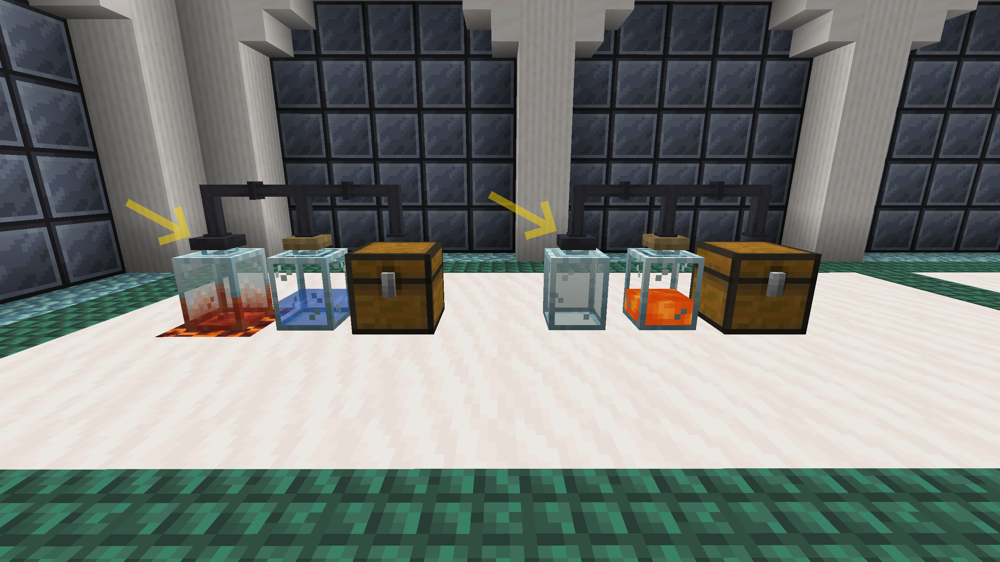

# FTB Jar Mod

FTB Jar Mod is a mod that was made primarily made for the modpack `FTB OceanBlock`. It features glass jars and tubes as a crafting mechanic to allow the player to craft more advanced blocks or items.

[Tempered Glass Jars](./contents/jars.md#tempered-glass-jar) are used to craft, and some cast iron tubes will connect [Glass Jars](./contents/jars.md#glass-jar) and inventories to them to provide materials for the crafts.

|  |
|:--:|
| <figcaption>[Tempered Glass Jars](./contents/jars.md#tempered-glass-jar) are recognizable by their metal lids</figcaption> |

Other inventories are also supported, such as modded fluid containers or item containers.

The mod does not add recipes in [Tempered Glass Jars](./contents/jars.md#tempered-glass-jar) by default, but you can add your own either with the [KubeJS integration](./for-kubejs.md) the mod possesses or with a [datapack](./for-datapacks.md) relatively easily.

[Tempered Glass Jars](./contents/jars.md#tempered-glass-jar) require a certain [temperature](./contents/jars.md) to operate, depending on the recipe. Some default temperatures are added to blocks. More blocks can be configured to have temperature, or you can also remove temperature from a certain block (see KubeJS integration or datapack above).

The crafting of some recipes using [Tempered Glass Jars](./contents/jars.md#tempered-glass-jar) can be automated using a [Jar Auto-Processing Block](./contents/automation.md).