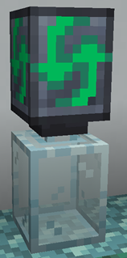

# Automated crafting

FTB Jar Mod allows players to automate [Tempered Glass Jars](./jars.md#tempered-glass-jar) by placing a Jar Auto-Processing Block on top of each jar they wish to automate.

The Jar Auto-Processing Block will change the behavior of the [Tempered Glass Jar](./jars.md#tempered-glass-jar), which will now attempt to craft the last selected recipe indefinitely.

TODO

